# Registry and Service Discovery Architecture

## Core Concept

Orth implements a **heartbeat-based service registry** where Executors actively register themselves with Admin servers every 30 seconds. Admin maintains a registry table and automatically removes stale entries after 90 seconds (3× heartbeat interval), enabling dynamic executor discovery.

## High-Level Architecture

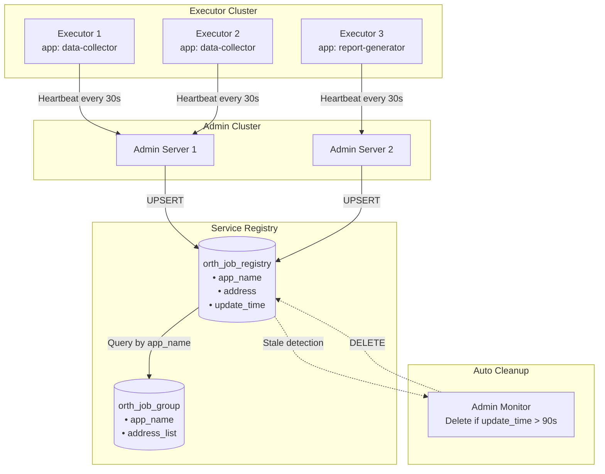

## Executor Registration Flow

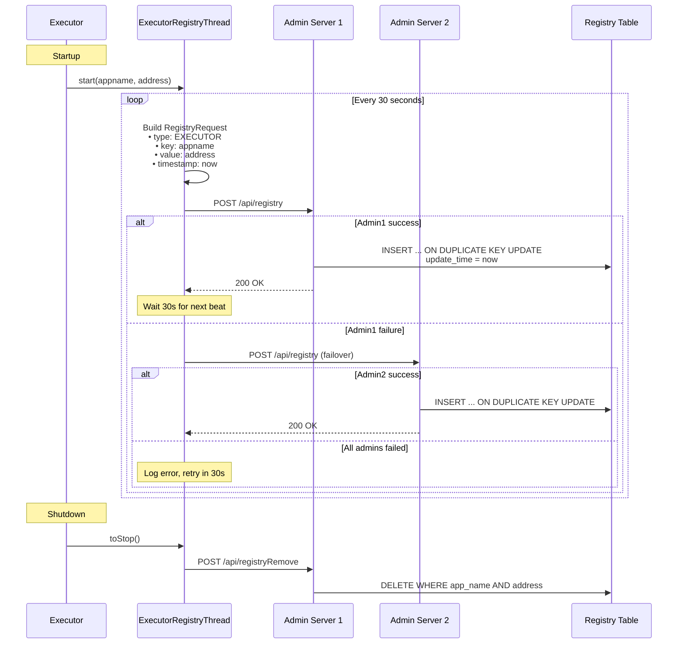

## Registry Table Schema

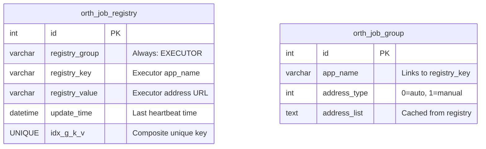

**Key Design:** Composite unique key `(registry_group, registry_key, registry_value)` ensures one row per executor instance.

## Admin-Side Discovery

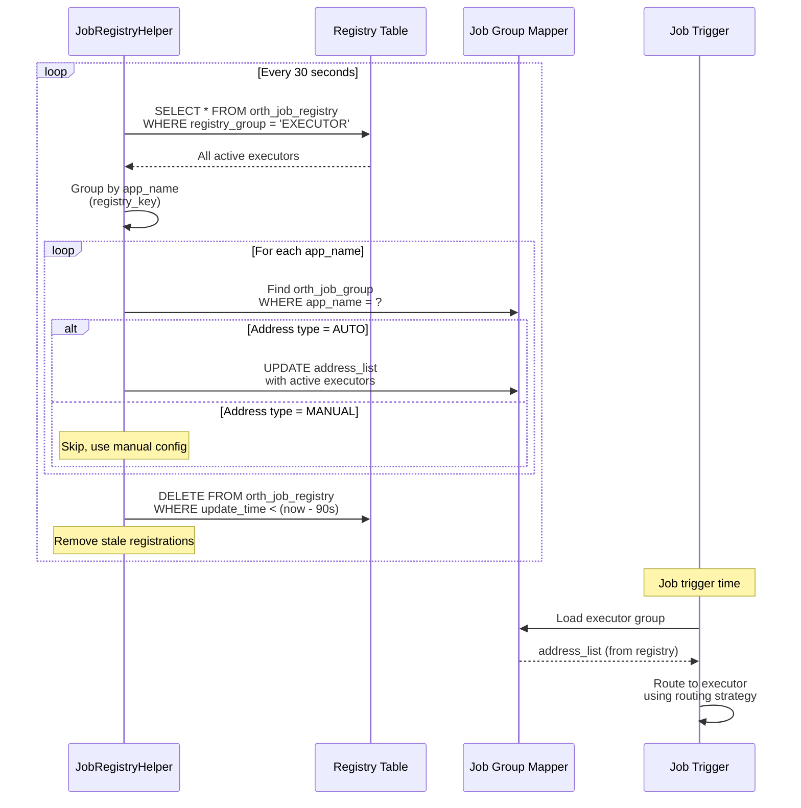

## Heartbeat Timing

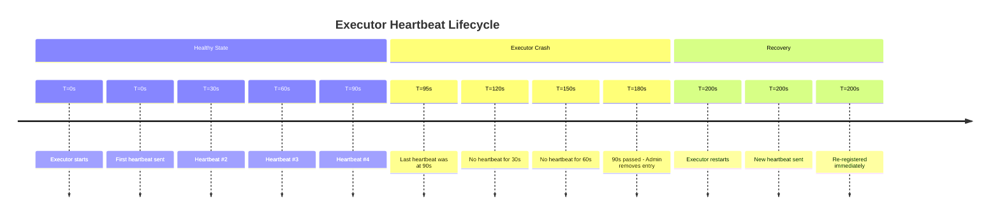

**Key Thresholds:**
- **Heartbeat interval**: 30 seconds
- **Dead timeout**: 90 seconds (3× heartbeat)
- **Detection frequency**: Every 30 seconds (admin monitor)

## Multi-Admin Failover

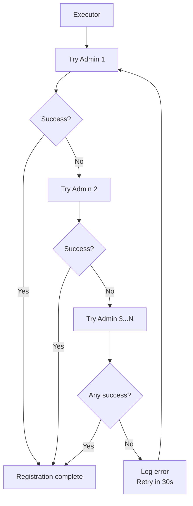

**Resilience:** Executor registers with ANY available admin server.

## Address Type Modes

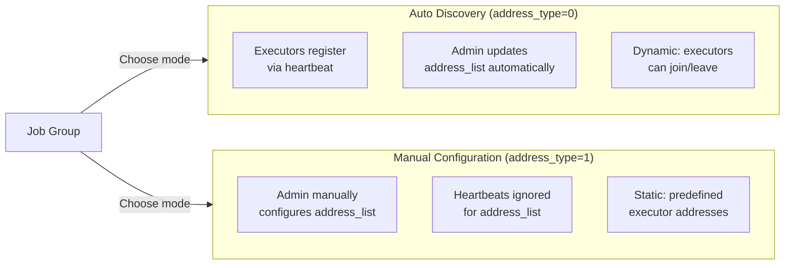

**Use Cases:**
- **Auto Mode**: Dynamic cloud environments, auto-scaling
- **Manual Mode**: Fixed infrastructure, specific IP requirements

## Registry Cleanup Process

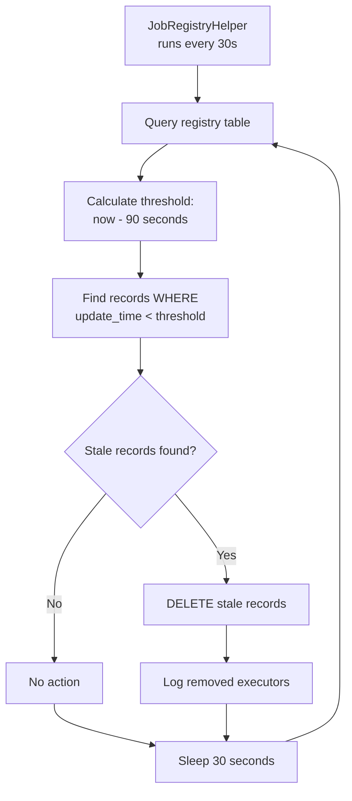

## Executor Discovery for Job Triggers

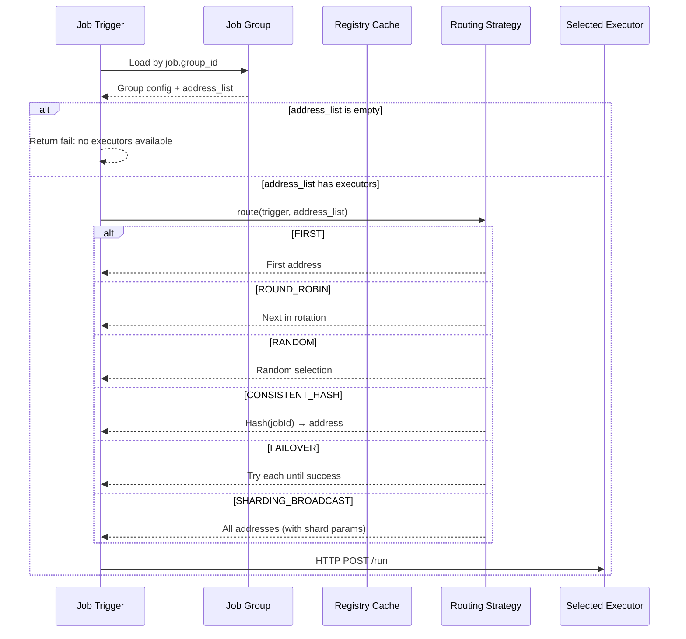

## State Transitions

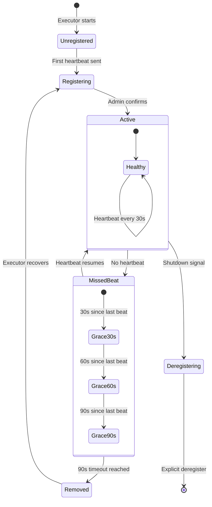

## Key Components

| Component | Location | Responsibility |
|-----------|----------|----------------|
| **ExecutorRegistryThread** | Executor side | Send heartbeats every 30s |
| **JobRegistryHelper** | Admin side | Process registrations, cleanup stale |
| **orth_job_registry** | Database | Store active executor addresses |
| **orth_job_group** | Database | Cache executor list per app |
| **OpenApiController** | Admin API | Handle `/api/registry` endpoint |

## Registration Request Format

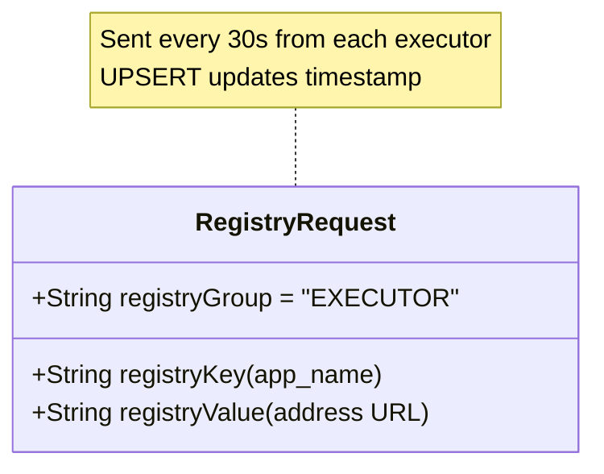

## Admin Registry Monitor Thread

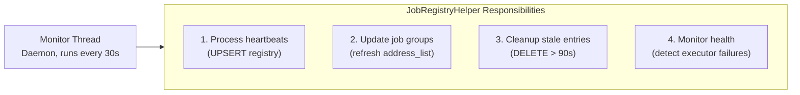

## Design Strengths

1. **Simple & Reliable**: Heartbeat-based, no complex consensus
2. **Fault Tolerant**: Multi-admin failover, automatic cleanup
3. **Dynamic Discovery**: Executors can join/leave freely
4. **Zero Configuration**: Auto-discovery mode requires no manual setup

## Design Limitations

1. **90-Second Detection Lag**: Dead executors remain visible for up to 90s
2. **Database Dependency**: Registry unavailable if DB is down
3. **No Health Checks**: Only presence detection, not actual health
4. **Polling-Based**: 30s granularity, not real-time updates

## Operational Metrics

| Metric | Value | Purpose |
|--------|-------|---------|
| Heartbeat interval | 30 seconds | Balance between freshness and load |
| Dead timeout | 90 seconds | 3× heartbeat for network tolerance |
| Registry cleanup cycle | 30 seconds | Match heartbeat frequency |
| UPSERT operation | Idempotent | Same request = same result |
| Failover targets | Multiple admins | High availability |

## Failure Scenarios

### Scenario 1: Executor Network Partition

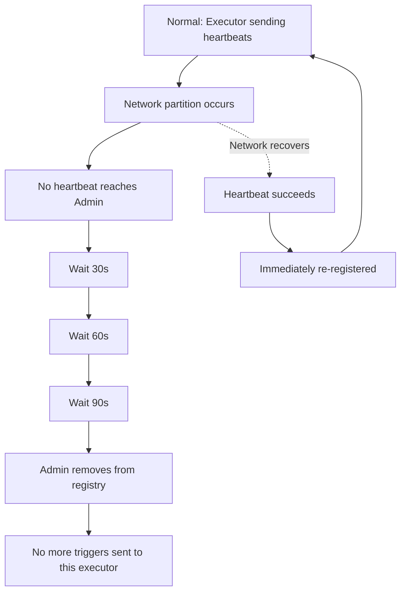

### Scenario 2: Admin Cluster Failure

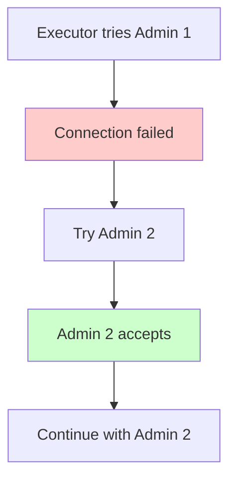

### Scenario 3: Database Unavailable

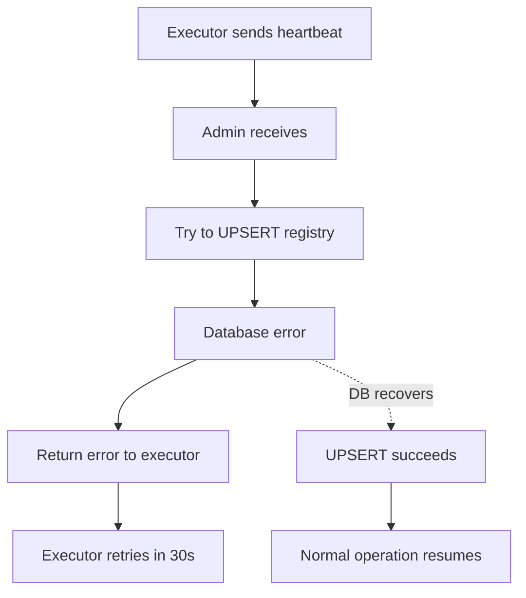

## Best Practices

1. **Configure Multiple Admins**: Use comma-separated addresses for failover
2. **Monitor Registry Size**: Alert if registry grows unboundedly
3. **Set Proper Network Timeouts**: Avoid long blocking on dead admins
4. **Use Auto Discovery**: Simplifies operations in dynamic environments
5. **Log Registration Failures**: Track patterns of connectivity issues
