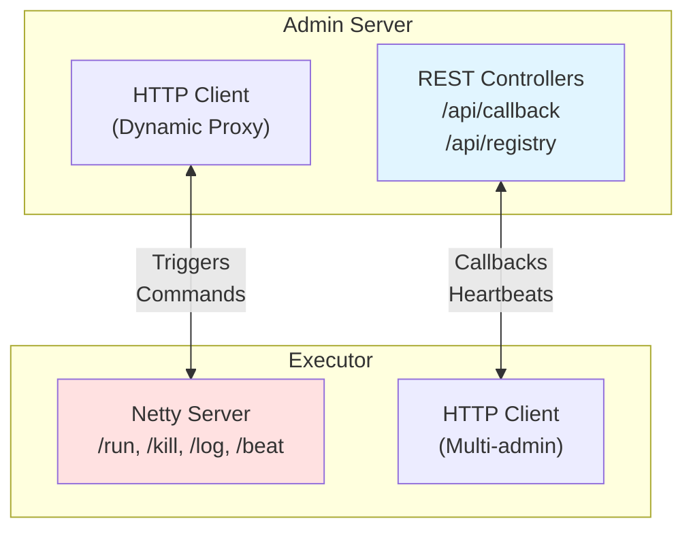
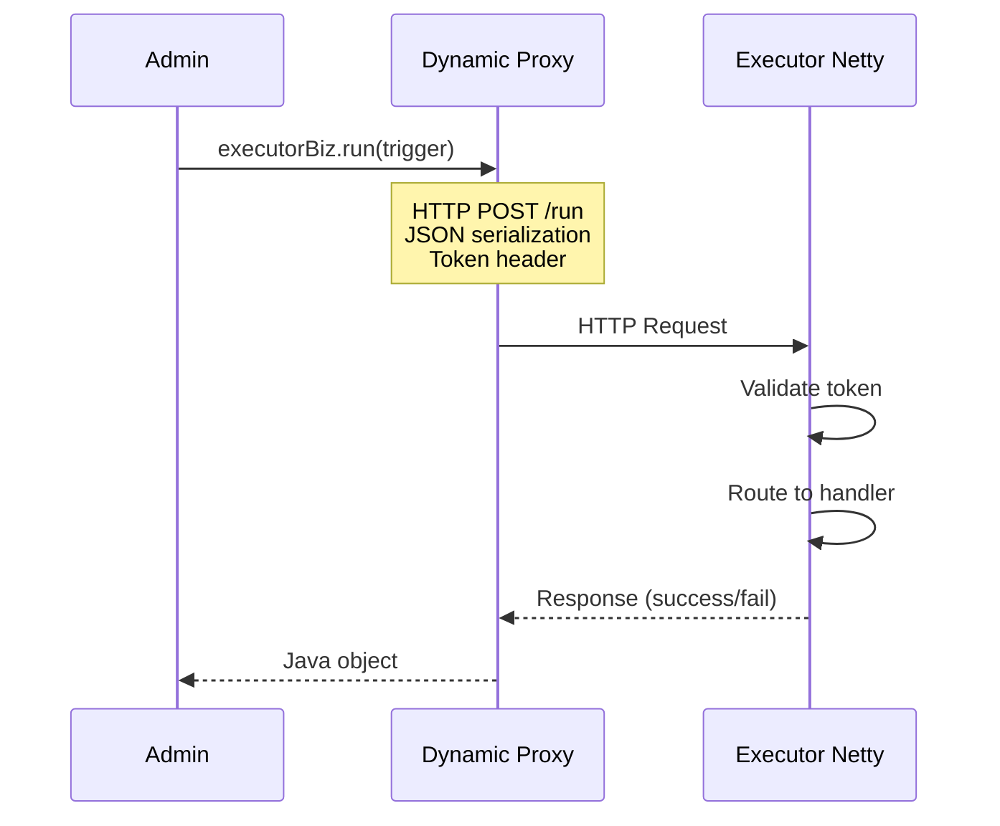
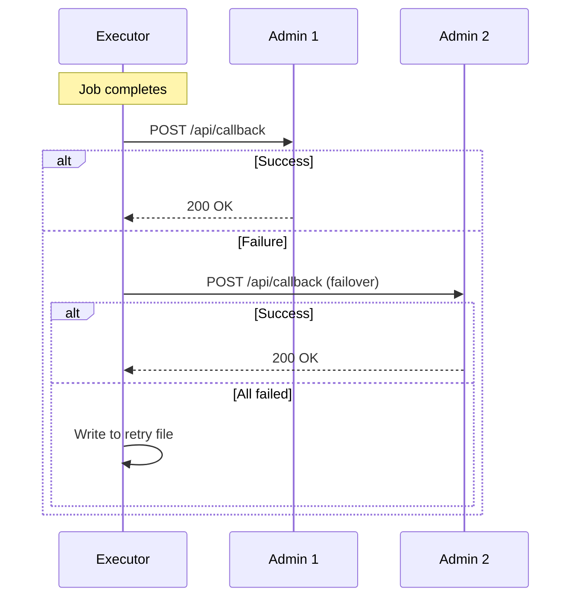
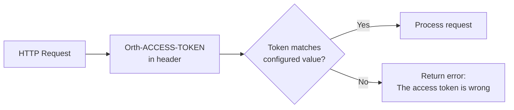
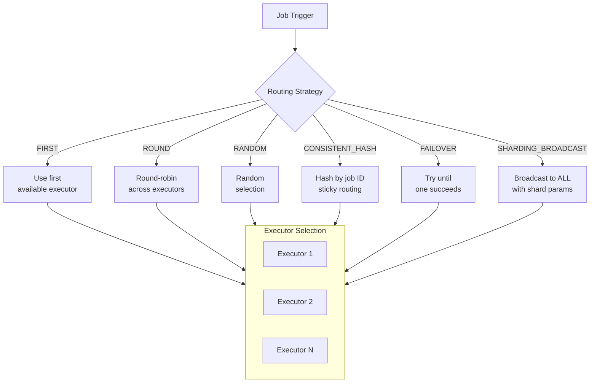
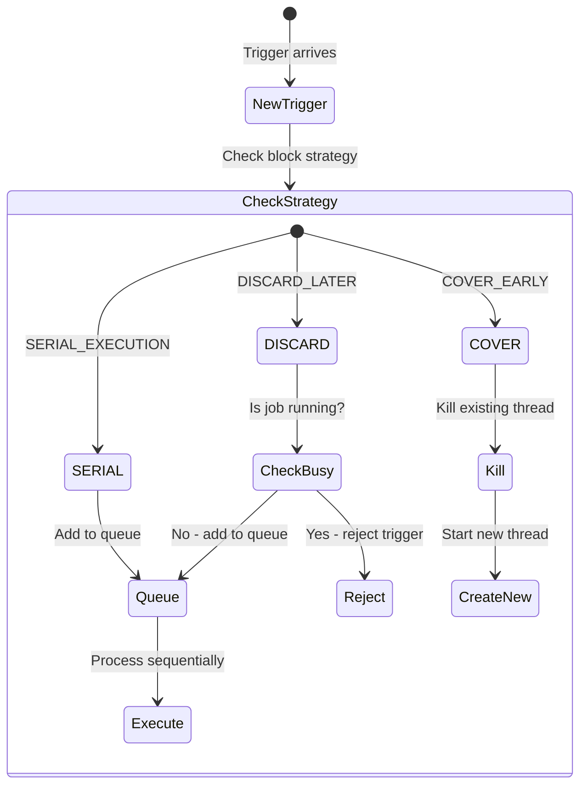
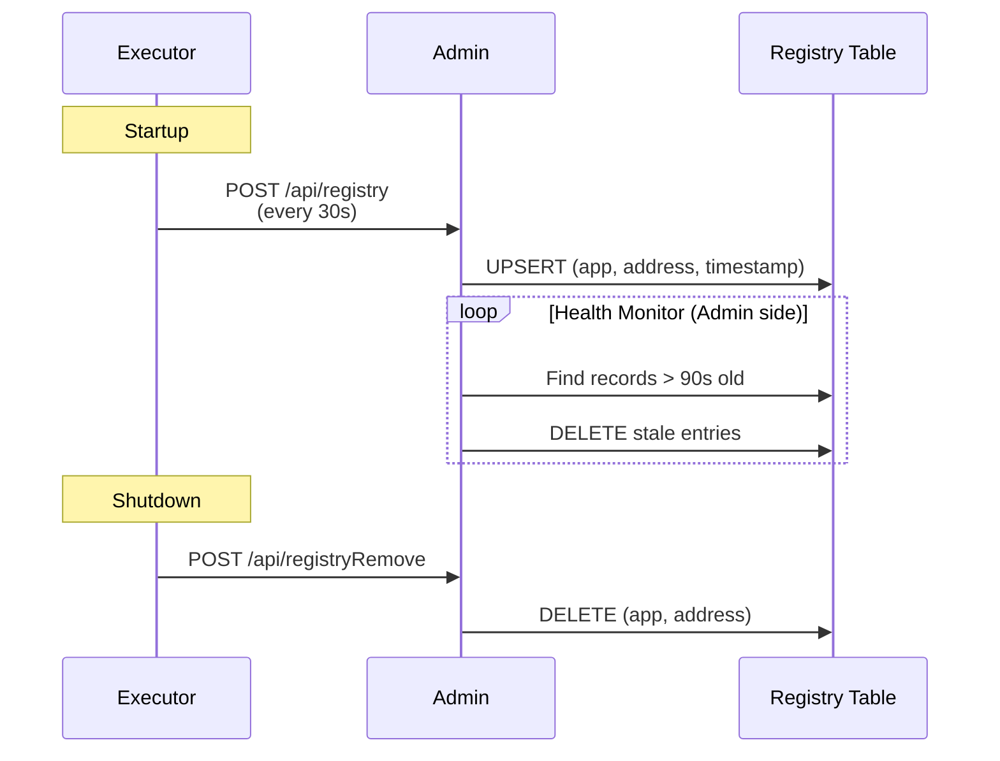
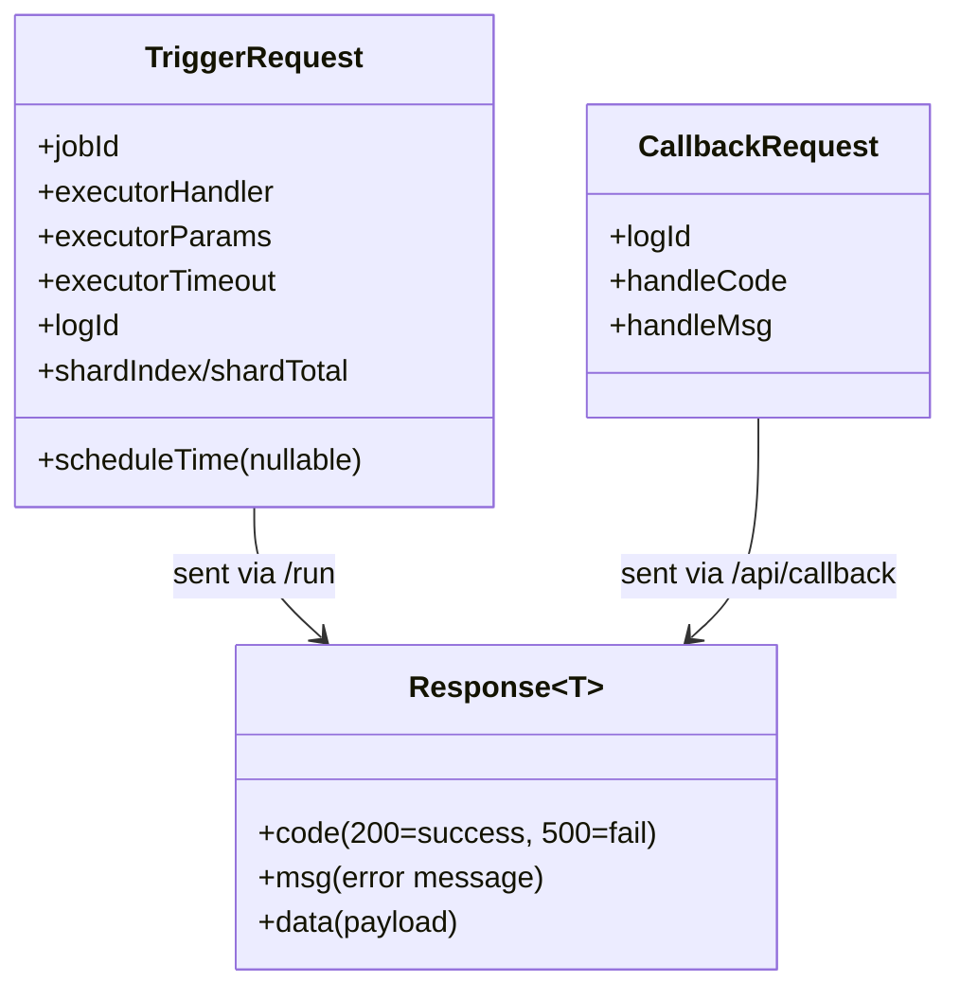
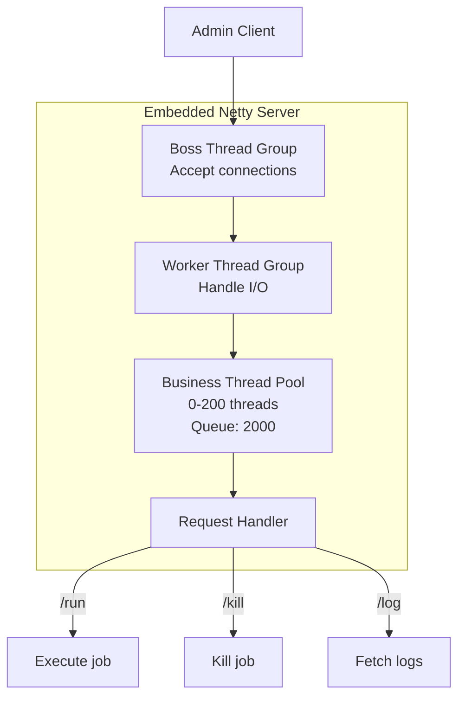

# API and RPC Architecture

## Core Concept

Orth implements **bidirectional HTTP/JSON RPC** between Admin and Executors, enabling cross-language support. Admin exposes REST APIs for callbacks/registration, while Executors run embedded Netty servers for job triggering.

## Communication Architecture

## Admin → Executor (Job Triggering)

**Key Endpoints:**

| Endpoint | Purpose | Request |
|----------|---------|---------|
| `/run` | Trigger job execution | TriggerRequest (job ID, params, timeout) |
| `/kill` | Terminate running job | KillRequest (job ID) |
| `/idleBeat` | Check if job is idle | IdleBeatRequest (job ID) |
| `/log` | Fetch execution logs | LogRequest (log ID, line offset) |
| `/beat` | Health check | Empty |

## Executor → Admin (Callbacks & Registration)

**Admin Endpoints:**

| Endpoint | Purpose |
|----------|---------|
| `/api/callback` | Report job results |
| `/api/registry` | Heartbeat registration |
| `/api/registryRemove` | Deregister on shutdown |

## Authentication Flow

**Security Model:**
- Shared secret token
- Transmitted in every request header
- No encryption (recommend HTTPS in production)

## Routing Strategy Selection

**Sharding Example:**
- Total executors: 3
- Executor 1 receives: `shardIndex=0, shardTotal=3`
- Executor 2 receives: `shardIndex=1, shardTotal=3`
- Executor 3 receives: `shardIndex=2, shardTotal=3`

## Block Strategy Handling

**Use Cases:**
- **SERIAL**: Prevent concurrent execution (e.g., database migrations)
- **DISCARD**: Skip if busy (e.g., real-time data fetch)
- **COVER**: Always use latest (e.g., cache warming)

## Executor Registration

**Key Thresholds:**
- Heartbeat interval: 30 seconds
- Dead timeout: 90 seconds (3× heartbeat)

## Request/Response Model

## Netty Server Architecture

**Configuration:**
- Thread pool: 0-200 threads (creates on demand)
- Queue capacity: 2000 requests
- Idle timeout: 90 seconds
- Max body size: 5 MB

## Design Strengths

1. **Cross-Language Support**: HTTP/JSON works with any language
2. **Fault Tolerance**: Multi-admin failover, automatic retry
3. **Flexible Routing**: Multiple strategies for different use cases
4. **Non-Blocking I/O**: Netty handles high concurrency efficiently

## Design Limitations

1. **No Circuit Breaker**: Dead executors cause timeout on every trigger
2. **No Rate Limiting**: Vulnerable to flood attacks
3. **Plaintext Token**: Authentication token not encrypted
4. **No API Versioning**: Breaking changes require coordinated deployment
