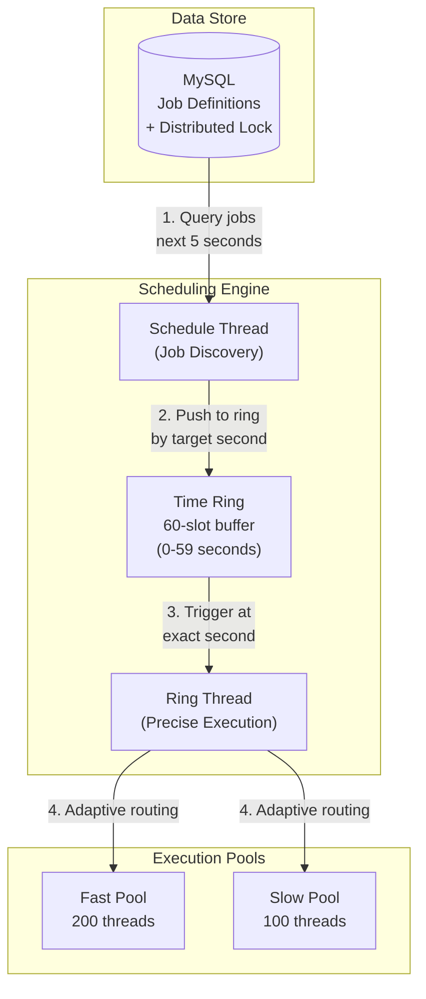
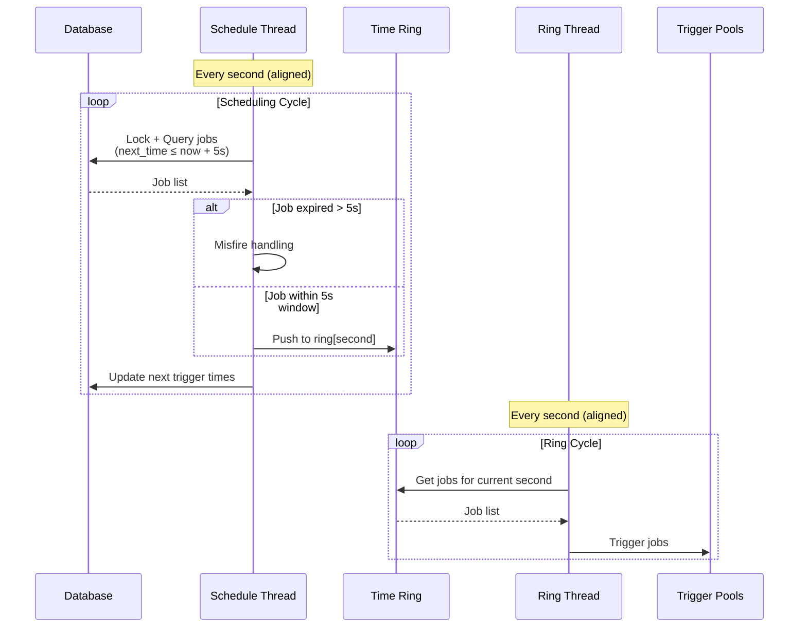
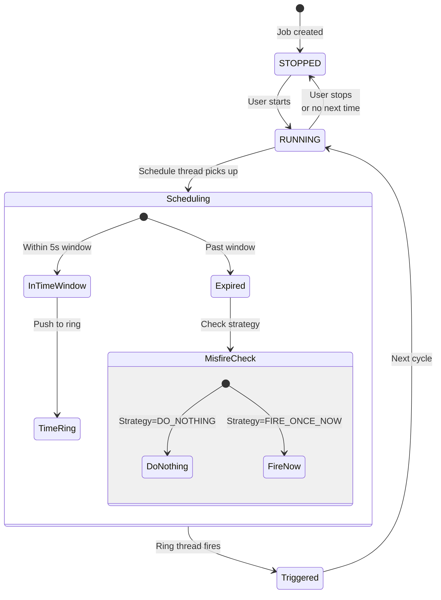
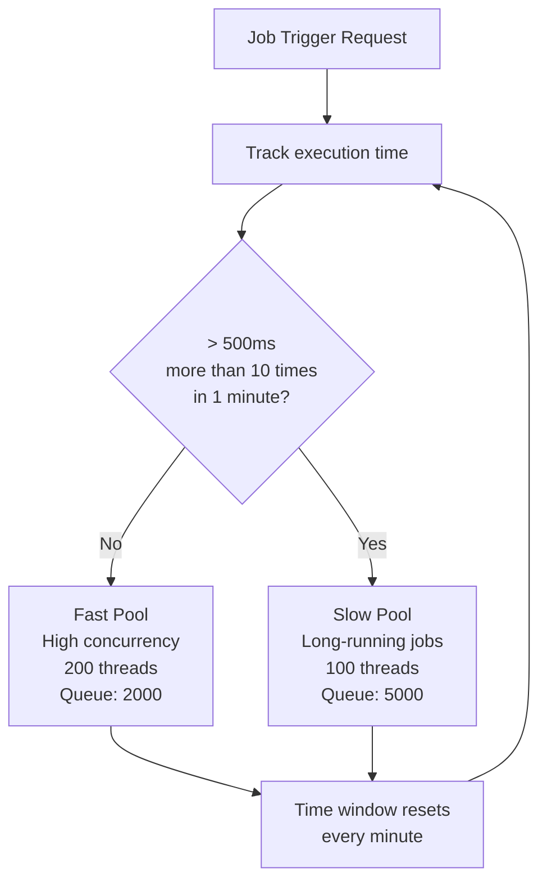
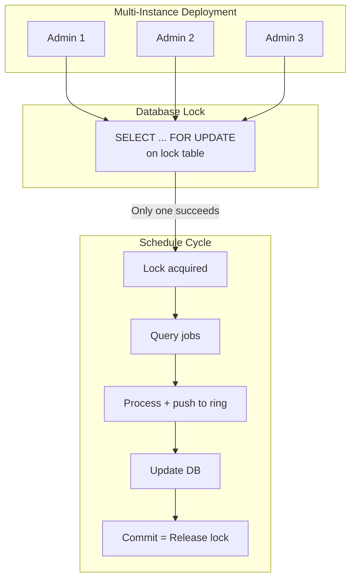
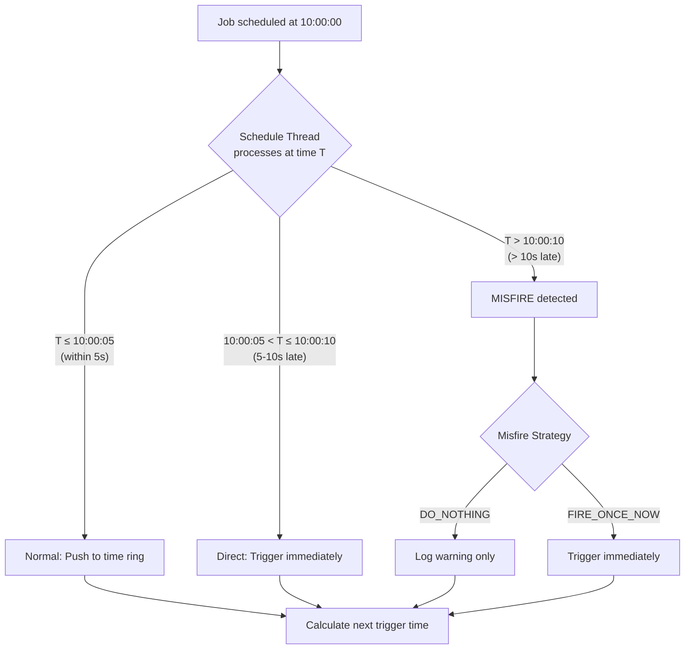
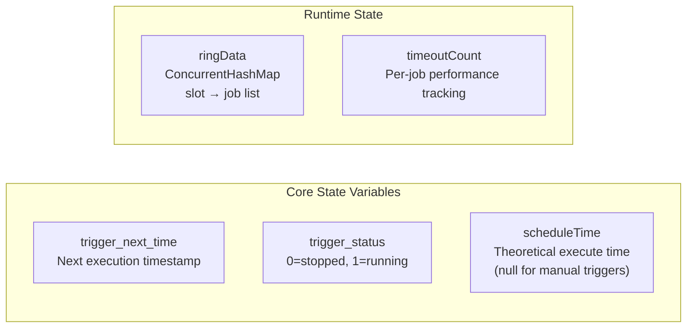
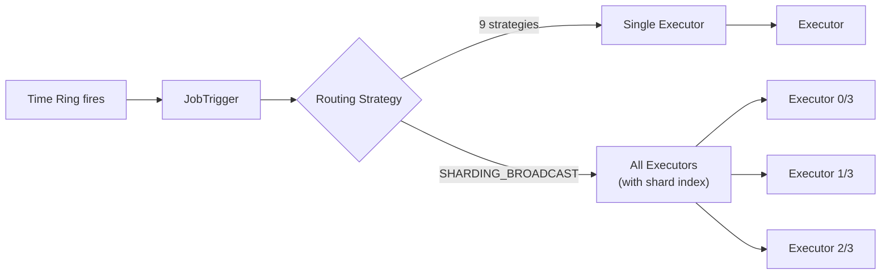
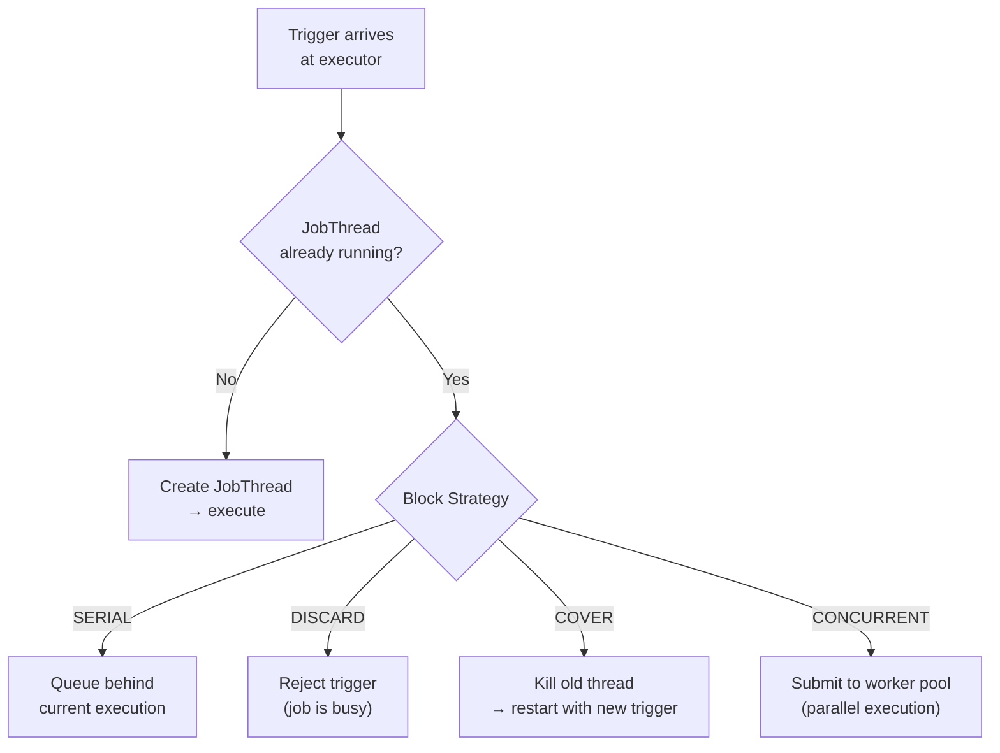

# Scheduling and Misfire Architecture

## Core Concept

Orth uses a **time-ring buffer** algorithm to achieve precise second-level job scheduling. The scheduler pre-reads jobs 5 seconds ahead and distributes them into a 60-slot ring buffer, enabling exact-second triggering without database queries at execution time.

## High-Level Architecture

## Time Ring Algorithm

```mermaid
flowchart LR
    subgraph PreRead["Pre-Read Window (5s)"]
        direction TB
        P1["Job scheduled at 10:00:01"]
        P2["Job scheduled at 10:00:03"]
        P3["Job scheduled at 10:00:05"]
    end
    
    subgraph TimeRing["Time Ring Buffer"]
        S0["Slot 0<br/>[]"]
        S1["Slot 1<br/>[Job A, Job C]"]
        S2["Slot 2<br/>[]"]
        S3["Slot 3<br/>[Job B]"]
        S4["Slot 4<br/>[]"]
        S5["Slot 5<br/>[Job D]"]
        Dots["..."]
        S59["Slot 59<br/>[]"]
    end
    
    subgraph Execution["Ring Thread Execution"]
        E1["Every second:<br/>Check current + 2 previous slots"]
        E2["Deduplicate by jobId"]
        E3["Trigger all jobs in slots"]
    end
    
    PreRead -->|"Schedule Thread<br/>distributes"| TimeRing
    TimeRing -->|"Ring Thread<br/>consumes"| Execution
```

**Key Design Points:**
- **60 slots** = seconds in a minute
- **Pre-read 5s ahead** = balance between memory and accuracy
- **Check 3 slots** (current + 2 previous) = handle timing drift

## Dual-Thread Model

## Job State Machine

## Adaptive Pool Selection

**Rationale:** Prevent slow jobs from starving fast jobs.

## Distributed Lock Coordination

**Trade-off:** Simple and reliable, but limits horizontal scaling (only one instance schedules at a time).

## Misfire Handling

## Key Metrics

| Metric | Value | Purpose |
|--------|-------|---------|
| Pre-read window | 5 seconds | Job discovery ahead time |
| Time ring slots | 60 | Seconds in a minute |
| Ring check slots | 3 (current + 2 previous) | Handle timing drift |
| Misfire threshold | 5+ seconds | Delayed job detection |
| Fast pool capacity | 200 threads + 2000 queue | High-concurrency jobs |
| Slow pool capacity | 100 threads + 5000 queue | Long-running jobs |
| Pool switch threshold | 10 timeouts (500ms) in 1 min | Adaptive routing |

## Critical Variables

## Trigger Dispatch & Routing

After the time ring fires a job, `JobTrigger` resolves **which executor(s)** receive the trigger. This is the bridge between the scheduling engine (admin) and execution (executor).

### Dispatch Flow

### Routing Strategies

| Category | Strategies | Target | Use Case |
|----------|-----------|--------|----------|
| Fixed | FIRST, LAST | 1 executor (deterministic) | Debugging, single node |
| Distributing | ROUND, RANDOM, LFU, LRU | 1 executor (rotating) | Stateless jobs, load balancing |
| Affinity | CONSISTENT_HASH | 1 executor (sticky by job ID) | Jobs with local state/cache |
| Health-aware | FAILOVER, BUSYOVER | 1 executor (first healthy/idle) | Critical jobs |
| Broadcast | SHARDING_BROADCAST | **All executors** | Parallel data collection |

**Default behavior: one trigger → one executor.** Only SHARDING_BROADCAST fans out to all registered executors, each receiving its shard index and total count.

### Interaction with Block Strategies

Routing decides **where**, block strategy decides **what happens on arrival**:

**Key distinction:**
- **Routing** controls cross-executor parallelism (single vs broadcast)
- **Block strategy** controls intra-executor parallelism (serial vs concurrent)

These are orthogonal — SHARDING_BROADCAST + CONCURRENT means all executors run multiple instances in parallel.

## Design Strengths

1. **Sub-second Precision**: Time ring enables exact-second execution
2. **Scalable Pre-read**: Database queried once per second, not per job
3. **Fair Scheduling**: Slow jobs don't block fast jobs
4. **Drift Tolerance**: Checks multiple slots to handle timing variations

## Design Limitations

1. **Single Scheduler**: Database lock allows only one instance to schedule
2. **Memory Bound**: All jobs in 5s window held in memory
3. **Fixed Granularity**: Second-level only, no sub-second scheduling
4. **No Prioritization**: FIFO order within each second
