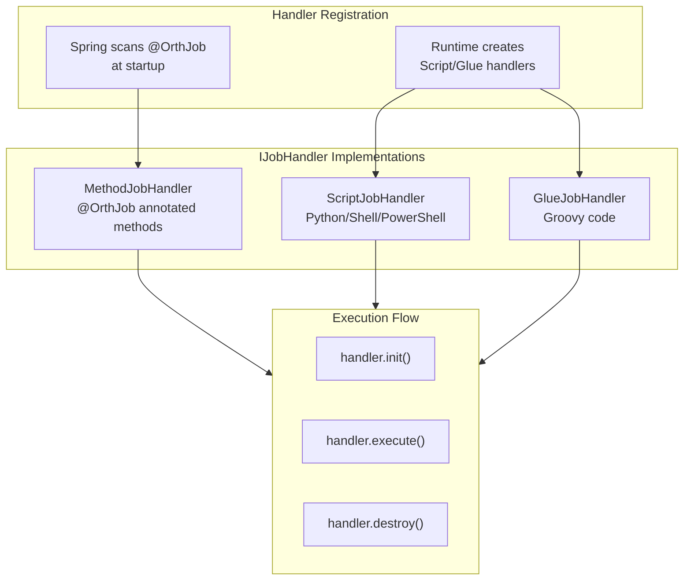

# Executor Implementation Architecture

## Core Concept

The executor implements a **thread-per-job** model where each job gets a dedicated `JobThread` with a trigger queue. This ensures job isolation and enables different block strategies (serial, discard, cover).

## High-Level Architecture

## JobThread Lifecycle

**Key Points:**
- Thread starts on first trigger
- Auto-cleanup after 90+ seconds idle (30 × 3s poll)
- Graceful shutdown drains queue

## Context Propagation

**Design Benefit:** User code can spawn threads and still access job context.

## Handler Types

## Script Execution Flow

**Environment Variables Passed:**
- `ORTH_JOB_ID`, `ORTH_JOB_PARAM`
- `ORTH_JOB_LOG_ID`
- `ORTH_JOB_SCHEDULE_TIME` (ISO 8601 or empty for manual)
- `ORTH_JOB_TRIGGER_TIME` (ISO 8601)
- `ORTH_JOB_SHARD_INDEX`, `ORTH_JOB_SHARD_TOTAL`

## Block Strategy Execution

## Timeout Enforcement

**Limitation:** Thread interrupt doesn't force-stop. Handler must cooperate.

## Callback Processing

## File Organization

## Idle Thread Cleanup

**Calculation:** 30 cycles × 3s = 90+ seconds idle before cleanup.

## Concurrent Execution

When `executorBlockStrategy = CONCURRENT` and `executorConcurrency > 1`, a `JobThread` uses an internal `ExecutorService` thread pool. The main thread becomes a dispatcher that polls triggers from the queue and submits them to worker threads.

### Execution Flow

### Behavior Details

| Aspect | Serial (concurrency=1) | Concurrent (concurrency>1) |
|--------|----------------------|---------------------------|
| Main thread role | Execute triggers inline | Dispatch to worker pool |
| `isRunningOrHasQueue()` | `running \|\| !queue.empty` | `activeCount > 0 \|\| !queue.empty` |
| Idle cleanup | `idleTimes > 30 && queue.empty` | `idleTimes > 30 && queue.empty && activeCount == 0` |
| Context (ThreadLocal) | Set by main thread | Set by each worker thread |
| Callback | Pushed in `finally` of main loop | Pushed in `finally` of each worker |
| Shutdown | `toStop` flag exits loop | `toStop` exits loop + `shutdownNow()` on pool |
| `init()/destroy()` | Called once by main thread | Called once by main thread (not per-worker) |

### Thread Safety Requirements

When using `CONCURRENT`, the job handler's `execute()` method **must be thread-safe**:
- No shared mutable state without synchronization
- `OrthJobContext` is per-thread (ThreadLocal) — safe
- `OrthJobHelper.log()` writes to per-execution log files — safe
- Handler `init()` and `destroy()` are called once (before/after all workers)

### Concurrency Change Detection

If a trigger arrives with a different `executorConcurrency` than the running `JobThread`, `ExecutorBizImpl` kills the old thread and creates a new one with the updated concurrency level. This ensures the pool size always matches the configured value.

## Key Metrics

| Metric | Value | Purpose |
|--------|-------|---------|
| Poll timeout | 3 seconds | Balance responsiveness vs CPU |
| Idle threshold | 30 cycles (90s) | Resource conservation |
| Message truncation | 50,000 chars | Prevent memory/network overload |
| Netty threads | 0-200 | Handle concurrent triggers |
| Callback retry interval | 30 seconds | Match heartbeat period |

## Design Strengths

1. **Isolation**: Each job has dedicated thread, no cross-job interference
2. **Backpressure**: Queue-based processing prevents overload
3. **Flexibility**: Supports Java methods, scripts in any language
4. **Fault Tolerance**: File-based retry survives restarts

## Design Limitations

1. **Memory Overhead**: One thread per active job
2. **No Sub-Second Scheduling**: Minimum granularity is seconds
3. **Timeout Cooperation**: Thread interrupt may not force-stop handler
4. **Unbounded Callback Queue**: OOM risk if admin unreachable for extended period
