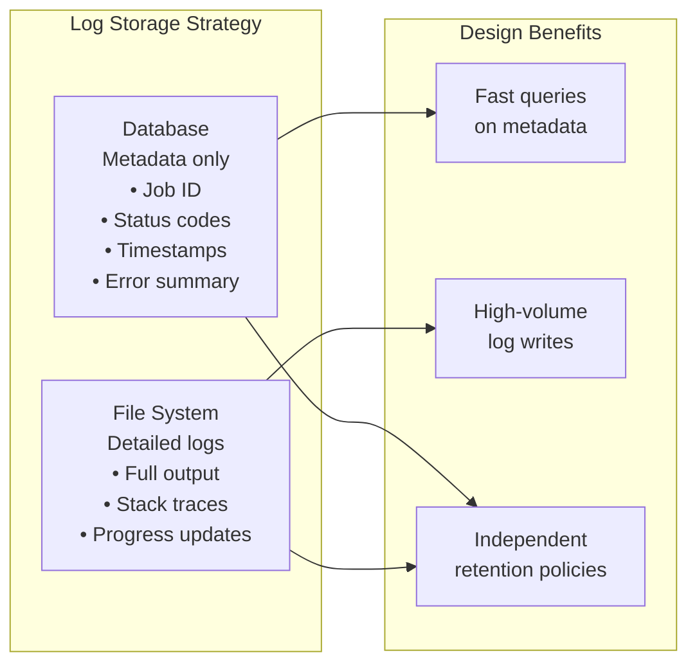
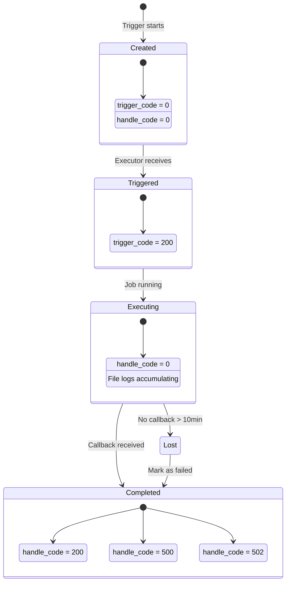
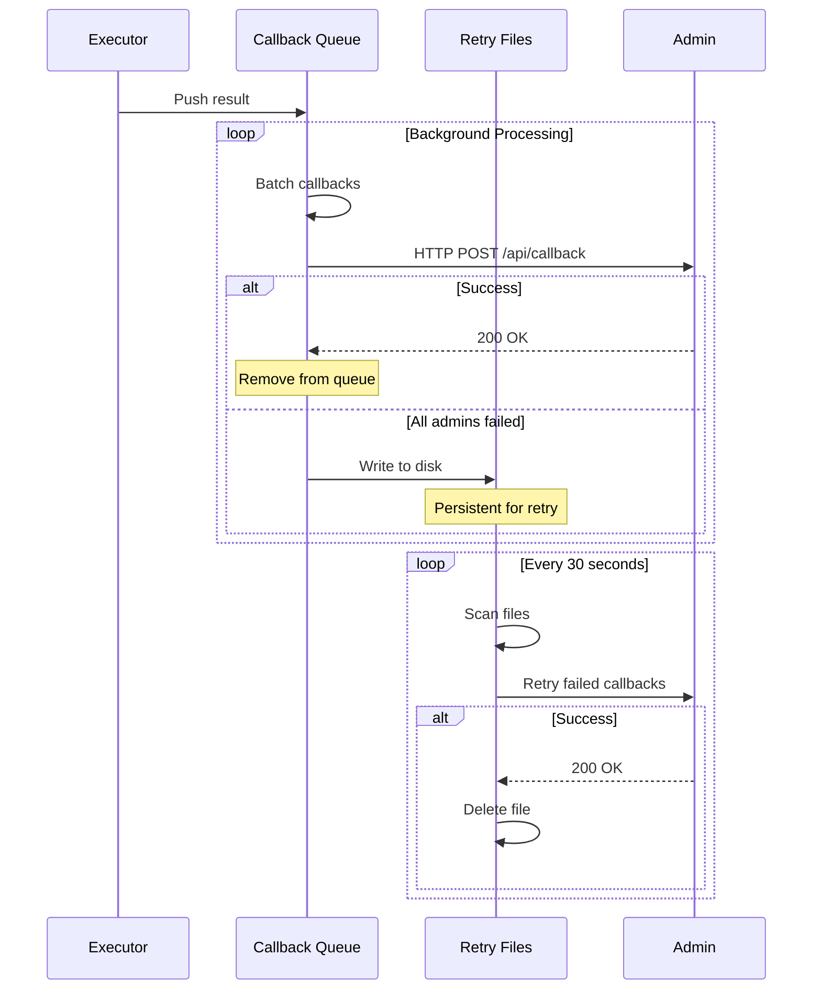
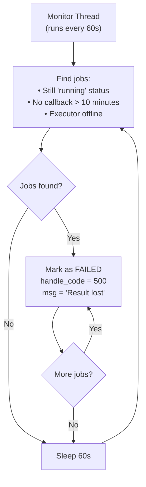
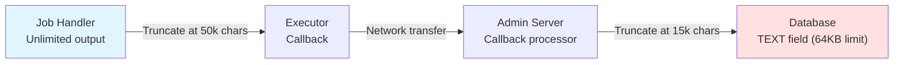
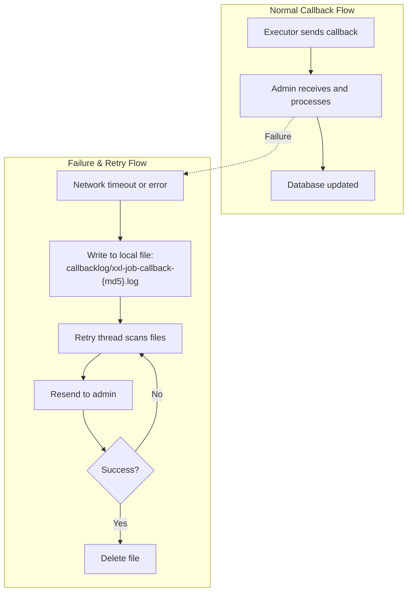
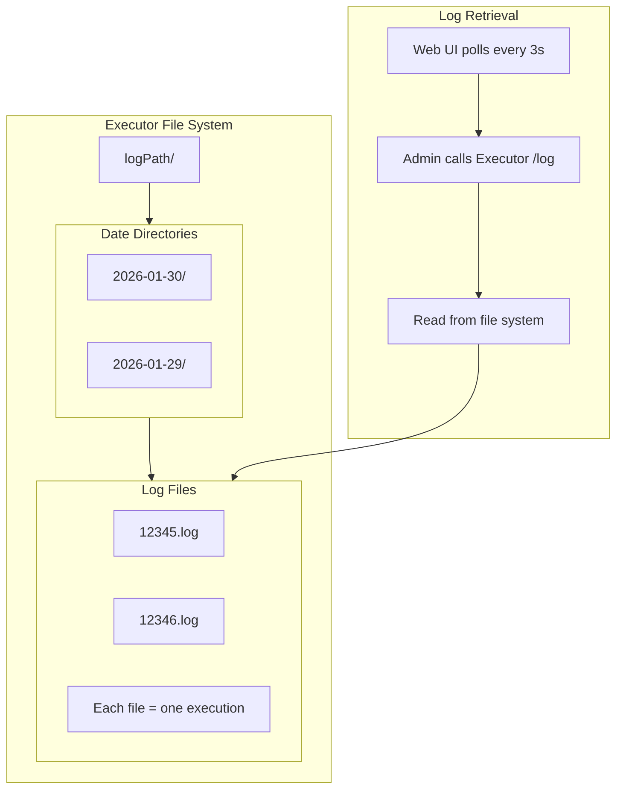

# Log Management Architecture

## Core Concept

Orth separates **metadata** (stored in database) from **detailed logs** (stored in files), enabling high-throughput logging with queryable history. Executors report results asynchronously via callbacks with file-based retry for reliability.

## Dual Storage Architecture



## Log Lifecycle



## Callback Flow



## Lost Job Detection



**Design Rationale:** Handles executor crashes that prevent callback delivery.

## Alarm Status Flow

```mermaid
stateDiagram-v2
    [*] --> Default: Log created
    Default --> Locked: Alarm monitor acquires
    
    state Locked {
        [*] --> Processing
        Processing: alarm_status = -1
        Processing: Prevents concurrent alarm
    }
    
    Locked --> NoAlarm: Job not found
    Locked --> AlarmSuccess: Alarm sent successfully
    Locked --> AlarmFailed: Alarm failed
    
    note right of Locked
        Optimistic lock:
        UPDATE ... WHERE alarm_status = 0
        Ensures single processing
    end note
```

## Message Truncation Strategy



**Trade-off:** Prevents database overflow but may lose critical debug info.

## Key Components

| Component | Responsibility | Key Behavior |
|-----------|---------------|--------------|
| **Admin: JobCompleteHelper** | Process callbacks | Thread pool (2-20 threads)<br/>Deduplicates by log ID |
| **Executor: TriggerCallbackThread** | Send results | Batches callbacks<br/>Retries on failure |
| **Executor: JobThread** | Generate logs | Writes to files<br/>Truncates messages |
| **Admin: Monitor Thread** | Detect lost jobs | Scans every 60s<br/>10-minute threshold |

## Retry Mechanism



**Reliability:** Survives executor restarts, admin downtime.

## File Organization



## Design Strengths

1. **High Throughput**: File writes don't block database
2. **Queryable History**: Database enables fast status queries
3. **Fault Tolerant**: File-based retry handles network failures
4. **Independent Scaling**: Log files on executor, metadata on admin

## Design Limitations

1. **10-Minute Lost Job Latency**: Too slow for fast jobs
2. **Race Condition Risk**: Duplicate callback not fully prevented
3. **No Streaming**: Polling-based log retrieval, not real-time
4. **Unbounded Callback Queue**: OOM risk if admin unreachable
