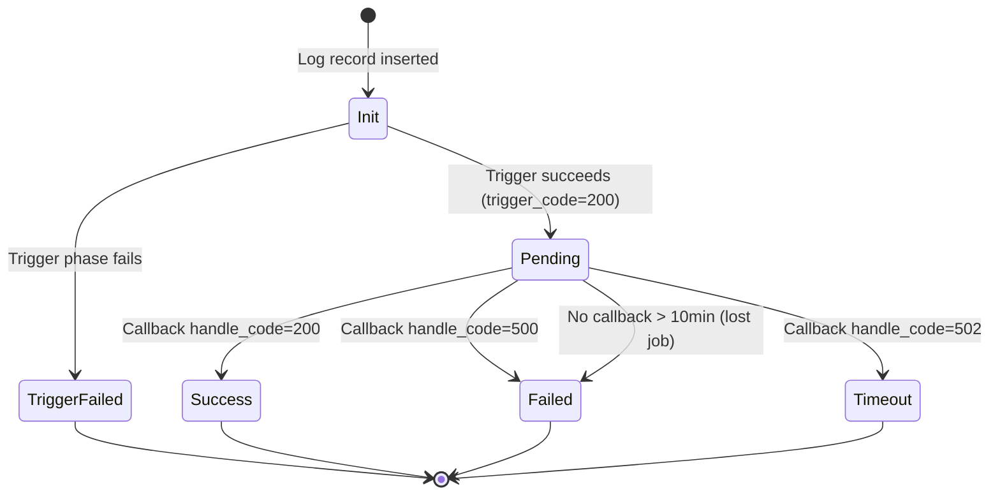

# Log Management Architecture

## Core Concept

Orth separates **metadata** (stored in database) from **detailed logs** (stored in files), enabling high-throughput logging with queryable history. Executors report results asynchronously via callbacks with file-based retry for reliability.

## Dual Storage Architecture


## Log Status Reference

A log record's status is derived from two database fields: `trigger_code` and `handle_code`.

| Status | `trigger_code` | `handle_code` | Scenario | Terminal? |
|--------|---------------|---------------|----------|-----------|
| **Init** | `0` | `0` | Log record just inserted, scheduler hasn't sent trigger request yet | No |
| **Pending** | `200` | `0` | Trigger succeeded (Admin→Executor HTTP returned 200), awaiting execution result | No |
| **Success** | `200` | `200` | Trigger succeeded + executor callback reported success | Yes |
| **Timeout** | `200` | `502` | Trigger succeeded, but execution timed out (JobThread detected `executorTimeout` exceeded) | Yes |
| **Trigger Failed** | `≠0, ≠200` (usually `500`) | any | Trigger phase failed: no available executor, routing failure, network error, missing handler, etc. | Yes |
| **Failed** | `200` | `≠0, ≠200, ≠502` (usually `500`) | Trigger succeeded, but executor callback reported failure (handler threw exception, returned FAIL, etc.) | Yes |

### Status Transitions

```
Init ──trigger──→ Trigger Failed          (terminal)
  │
  └──trigger ok──→ Pending ──callback──→ Success   (terminal)
                       │            ├──→ Failed    (terminal)
                       │            └──→ Timeout   (terminal)
                       │
                       └──no callback > 10min──→ Failed (lost job detection)
```

### UI Representation

The frontend merges these two codes into a single **Status** column with a clickable `<Tag>`:
- **Tag label**: `{status} {triggerCode}/{handleCode}` (e.g., `Success 200/200`)
- **Tag color**: green (Success), processing/blue (Pending), red (Failed/Trigger Failed), orange (Timeout), default/gray (Init)
- **Click**: Opens a popover showing the raw `trigger_msg` and `handle_msg` from the database for debugging

## Log Lifecycle



## Callback Flow


## Lost Job Detection


**Design Rationale:** Handles executor crashes that prevent callback delivery.

## Alarm Status Flow

```mermaid
stateDiagram-v2
    [*] --> Default: Log created
    Default --> Locked: Alarm monitor acquires
    
    state Locked {
        [*] --> Processing
        Processing: alarm_status = -1
        Processing: Prevents concurrent alarm
    }
    
    Locked --> NoAlarm: Job not found
    Locked --> AlarmSuccess: Alarm sent successfully
    Locked --> AlarmFailed: Alarm failed
    
    note right of Locked
        Optimistic lock:
        UPDATE ... WHERE alarm_status = 0
        Ensures single processing
    end note
```

## Message Truncation Strategy


**Trade-off:** Prevents database overflow but may lose critical debug info.

## Key Components

| Component | Responsibility | Key Behavior |
|-----------|---------------|--------------|
| **Admin: JobCompleteHelper** | Process callbacks | Thread pool (2-20 threads)<br/>Deduplicates by log ID |
| **Executor: TriggerCallbackThread** | Send results | Batches callbacks<br/>Retries on failure |
| **Executor: JobThread** | Generate logs | Writes to files<br/>Truncates messages |
| **Admin: Monitor Thread** | Detect lost jobs | Scans every 60s<br/>10-minute threshold |

## Retry Mechanism


**Reliability:** Survives executor restarts, admin downtime.

## File Organization


## Design Strengths

1. **High Throughput**: File writes don't block database
2. **Queryable History**: Database enables fast status queries
3. **Fault Tolerant**: File-based retry handles network failures
4. **Independent Scaling**: Log files on executor, metadata on admin

## Design Limitations

1. **10-Minute Lost Job Latency**: Too slow for fast jobs
2. **Race Condition Risk**: Duplicate callback not fully prevented
3. **No Streaming**: Polling-based log retrieval, not real-time
4. **Unbounded Callback Queue**: OOM risk if admin unreachable
