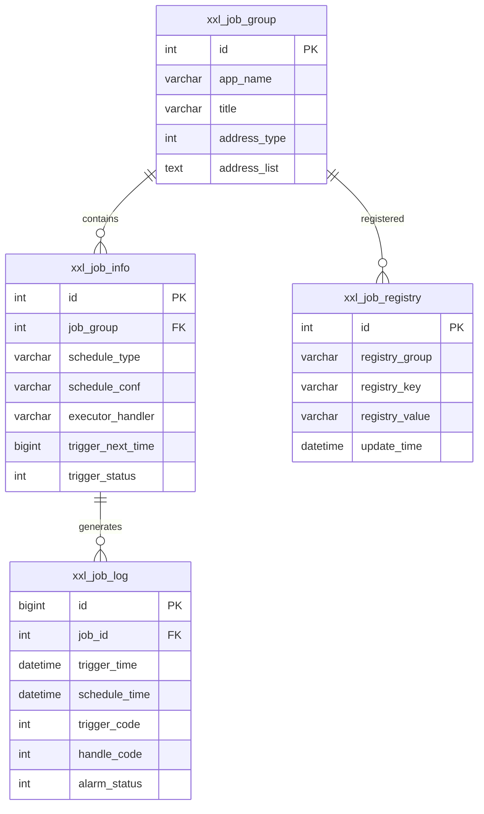
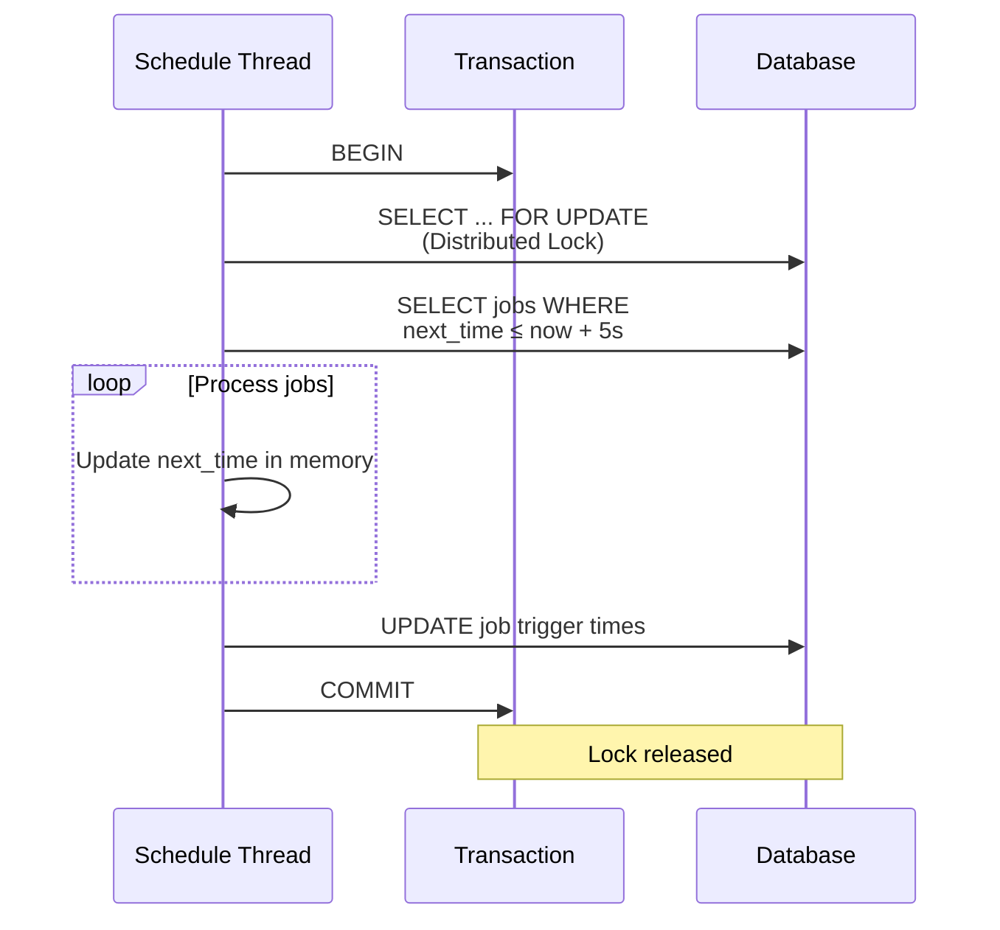
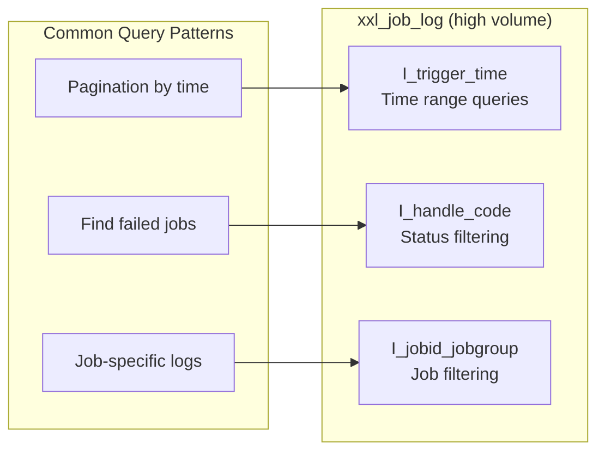
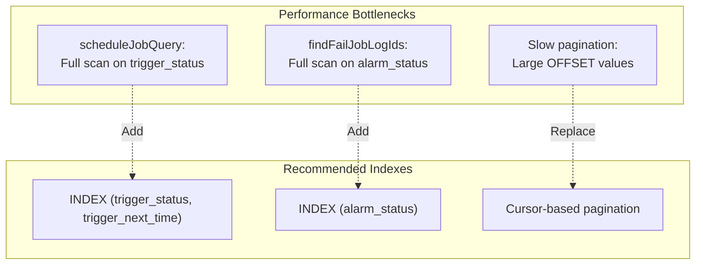
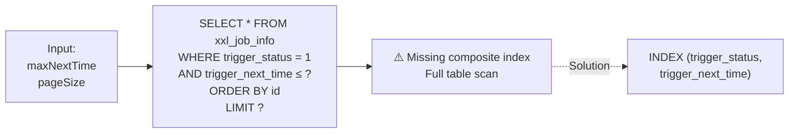
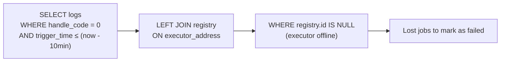
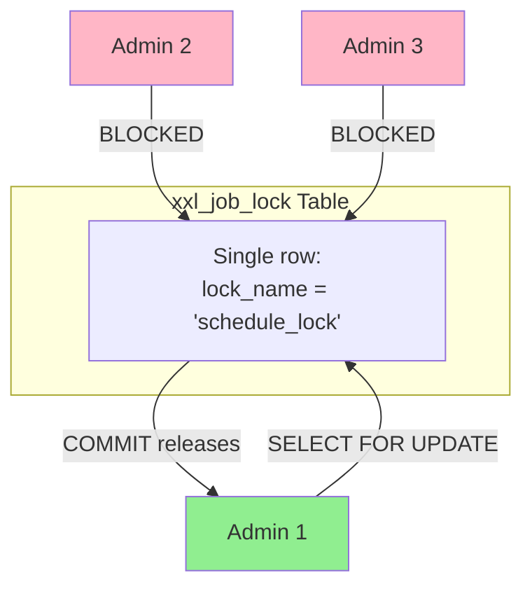
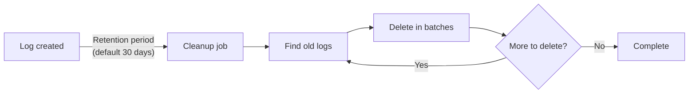
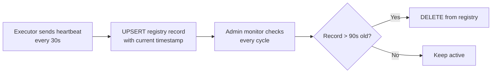

# Database Layer Architecture

## Core Schema

## Data Volume Characteristics

| Table | Volume | Growth Rate |
|-------|--------|-------------|
| `xxl_job_group` | Low (~10s) | Static |
| `xxl_job_info` | Medium (~1000s) | Slow |
| **`xxl_job_log`** | **High (millions)** | **Fast** |
| `xxl_job_registry` | Low (~100s) | Moderate |

**Key Design:** `xxl_job_log` uses `bigint` ID to support high-volume logging.

## Transaction Patterns

### Schedule Cycle (Explicit Transaction)

**Purpose:** Ensure atomic scheduling across distributed admin instances.

### Service Layer (Auto-Commit)

Most operations rely on MyBatis auto-commit:
- Single INSERT/UPDATE/DELETE statements
- No explicit transaction boundaries
- Trade-off: Simpler code but less safety for multi-step operations

## Index Strategy

### Critical Indexes

### Missing Indexes (Performance Issues)

## Query Patterns

### Schedule Query (Critical Path)

**Impact:** Executed every second by scheduler.

### Lost Job Detection

**Design:** Anti-join pattern finds logs from unregistered executors.

## Distributed Lock Mechanism

**Characteristics:**
- Pessimistic lock (row-level)
- Transaction-scoped
- Simple but limits horizontal scaling

## Data Lifecycle

### Log Retention

### Registry Cleanup

## Design Strengths

1. **Optimized for Log Volume**: Bigint IDs, strategic indexes
2. **Simple Locking**: Database-native distributed coordination
3. **Flexible Queries**: MyBatis dynamic SQL for complex filtering
4. **Denormalized for Performance**: Reduces JOINs in hot paths

## Design Limitations

1. **Single-Instance Scheduling**: Lock bottleneck
2. **Offset Pagination**: Degrades with large offsets
3. **Missing Indexes**: Some queries scan full tables
4. **N+1 Query Patterns**: Loop-based loading instead of batch
