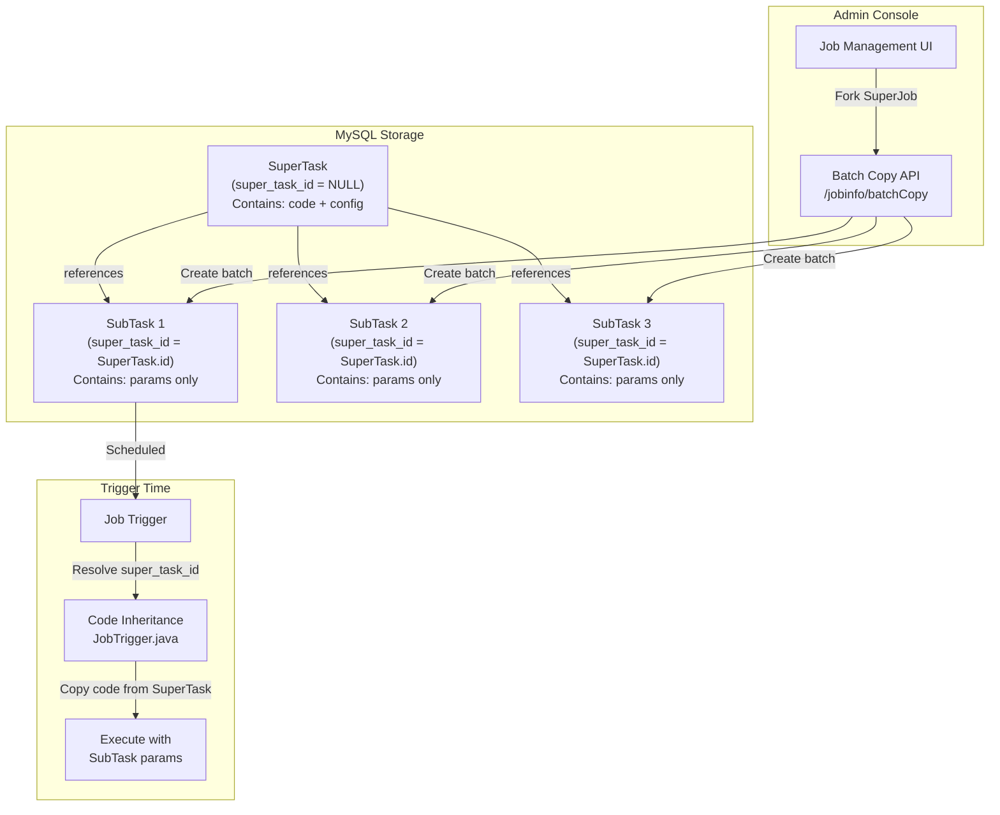

# SuperTask Template-Instance Pattern

## Core Concept

The **SuperTask pattern** implements a template-instance architecture where a parent job (SuperTask) defines executable code while child jobs (SubTasks) provide varying parameters. This enables batch creation of similar jobs that share code but differ in configuration, ideal for high-performance batch data collection tasks in the Abyss project.

**Key Principle**: Code inheritance at trigger time - SubTasks dynamically inherit their SuperTask's code when executed, eliminating code duplication and enabling centralized updates.

## Architecture Overview



## Database Schema

### New Column: `super_task_id`

```sql
ALTER TABLE xxl_job_info
ADD COLUMN super_task_id INT DEFAULT NULL COMMENT 'SuperTask ID for code inheritance (NULL = SuperTask, non-NULL = SubTask)';
```

**Design Rationale:**
- `NULL` = Job is a SuperTask (or standalone job)
- `Non-NULL` = Job is a SubTask that inherits from `super_task_id`
- Foreign key relationship enables cascade delete protection
- Indexed for fast SuperTask lookups during trigger

## Template-Instance Workflow


## API Design

### Batch Copy Endpoint

**POST** `/jobinfo/batchCopy`

```json
{
  "templateJobId": 123,
  "mode": "advanced",
  "tasks": [
    {
      "jobDesc": "Data Collection - Region A",
      "executorParam": "region=A",
      "scheduleConf": "0 0 2 * * ?"
    },
    {
      "jobDesc": "Data Collection - Region B",
      "executorParam": "region=B",
      "scheduleConf": "0 0 3 * * ?"
    },
    {
      "jobDesc": "Data Collection - Region C",
      "executorParam": "region=C",
      "scheduleConf": "0 0 4 * * ?"
    }
  ],
  "scheduleType": "CRON",
  "author": "admin"
}
```

**Response:**

```json
{
  "code": 200,
  "msg": null,
  "data": {
    "successCount": 3,
    "failCount": 0,
    "createdJobIds": [124, 125, 126],
    "errors": []
  }
}
```

### Mode Comparison

| Feature | Simple Mode | Advanced Mode |
|---------|-------------|---------------|
| **Input** | Array of strings (params) | Array of SubTaskConfig objects |
| **Name Generation** | Template-based `{origin}-{index}` | Explicit per SubTask |
| **Customization** | executor_param only | Full per-SubTask config |
| **Use Case** | Quick parameterized duplication | Complex batch with different schedules |

## Code Inheritance Mechanism

### Trigger-Time Resolution

**Location**: `JobTrigger.java:trigger()`

```java
// Step 1: Load SubTask from database
XxlJobInfo jobInfo = XxlJobAdminConfig.getAdminConfig()
    .getXxlJobInfoMapper().loadById(jobId);

// Step 2: Check if SubTask references a SuperTask
if (jobInfo.getSuperTaskId() != null && jobInfo.getSuperTaskId() > 0) {
    // Step 3: Load SuperTask
    XxlJobInfo superTask = XxlJobAdminConfig.getAdminConfig()
        .getXxlJobInfoMapper().loadById(jobInfo.getSuperTaskId());

    if (superTask != null) {
        // Step 4: Inherit code from SuperTask
        jobInfo.setGlueSource(superTask.getGlueSource());
        jobInfo.setGlueUpdatetime(superTask.getGlueUpdatetime());
    }
}

// Step 5: Trigger with inherited code + SubTask params
```

**Inherited Fields:**
- `glue_source` - Executable code (Groovy, Shell, Python, etc.)
- `glue_updatetime` - Code version timestamp

**SubTask-Specific Fields:**
- `executor_param` - Custom parameters
- `job_desc` - Description
- `schedule_conf` - Schedule configuration
- `alarm_email` - Alert recipients

## Frontend Integration

### Fork SuperJob Button

**Location**: `job.list.ftl` (line ~80)

```html
<button class="btn btn-sm btn-primary selectOnlyOne job_fork_super" type="button">
    <i class="fa fa-sitemap"></i>Fork SuperJob
</button>
```

### JSON Template Generator

**JavaScript Handler**:

```javascript
$("#data_operation").on('click', '.job_fork_super', function() {
    var row = rows[0]; // Selected SuperTask

    var templateJson = {
        "templateJobId": row.id,
        "mode": "advanced",
        "tasks": [
            {
                "jobDesc": row.jobDesc + " - SubTask 1",
                "executorParam": "param1"
            },
            {
                "jobDesc": row.jobDesc + " - SubTask 2",
                "executorParam": "param2"
            },
            {
                "jobDesc": row.jobDesc + " - SubTask 3",
                "executorParam": "param3"
            }
        ]
    };

    $('#forkSuperJsonContent').val(JSON.stringify(templateJson, null, 2));
    $('#jobForkSuperModal').modal('show');
});
```

### SuperTask Selection in Create/Edit Modals

**Location**: `job.list.ftl` - Add Modal & Update Modal

Users can now assign a SuperTask when creating or editing a job, establishing the parent-child relationship directly through the UI.

**HTML Structure** (Advanced Configuration Section):

```html
<div class="form-group">
    <label class="col-sm-2 control-label">SuperTask</label>
    <div class="col-sm-4">
        <select class="form-control" name="superTaskId">
            <option value="">-- None (Standalone Job) --</option>
            <!-- Options loaded dynamically via AJAX -->
        </select>
        <!-- Edit link only shown in Update Modal when SuperTask selected -->
        <span class="help-block">
            <a href="javascript:void(0);" class="editSuperTaskLink" style="display:none;">
                <i class="fa fa-edit"></i> Edit SuperTask Code
            </a>
        </span>
    </div>
</div>
```

**Dynamic Option Loading**:

```javascript
function loadSuperTaskOptions(jobGroup, modalId) {
    var $select = $(modalId + ' select[name="superTaskId"]');

    // Clear and add default option
    $select.html('<option value="">-- None (Standalone Job) --</option>');

    if (jobGroup > 0) {
        $.ajax({
            type: 'GET',
            url: base_url + '/jobinfo/getSuperTaskList',
            data: { jobGroup: jobGroup },
            success: function(data) {
                if (data.code == 200 && data.data) {
                    data.data.forEach(function(job) {
                        $select.append('<option value="' + job.id + '">' +
                            job.id + ' - ' + job.jobDesc + '</option>');
                    });
                }
            }
        });
    }
}

// Reload options when job group changes
$("#addModal select[name='jobGroup']").on('change', function() {
    loadSuperTaskOptions($(this).val(), '#addModal');
});
```

**API Endpoint** (`JobInfoController.java`):

```java
@RequestMapping("/getSuperTaskList")
@ResponseBody
public Response<List<XxlJobInfo>> getSuperTaskList(
        HttpServletRequest request, @RequestParam int jobGroup) {
    // Validate permission
    JobGroupPermissionUtil.validJobGroupPermission(request, jobGroup);

    // Get all jobs in the group (potential SuperTasks)
    List<XxlJobInfo> jobs = xxlJobInfoMapper.getJobsByGroup(jobGroup);
    return Response.ofSuccess(jobs);
}
```

**Features**:
- Dropdown filtered by selected job group
- Only shows jobs within the same executor group
- Permission-aware (only shows jobs user can access)
- Auto-refresh when job group changes

### Edit SuperTask Code Link

**Location**: Update Modal only

When editing a SubTask (job with `superTaskId` set), a link appears allowing direct navigation to the SuperTask's code editor.

**Show/Hide Logic**:

```javascript
// Show link when SuperTask selected
$("#updateModal select[name='superTaskId']").on('change', function() {
    var superTaskId = $(this).val();
    if (superTaskId && superTaskId !== '') {
        $("#updateModal .editSuperTaskLink")
            .show()
            .data('superTaskId', superTaskId);
    } else {
        $("#updateModal .editSuperTaskLink").hide();
    }
});

// Handle link click - open GLUE IDE for SuperTask
$("#updateModal").on('click', '.editSuperTaskLink', function(e) {
    e.preventDefault();
    var superTaskId = $(this).data('superTaskId');
    if (superTaskId) {
        $('#updateModal').modal('hide');
        window.open(base_url + '/jobcode?jobId=' + superTaskId);
    }
});
```

**User Workflow**:
1. User edits a SubTask
2. Sees selected SuperTask in dropdown
3. Clicks "Edit SuperTask Code" link
4. Opens GLUE IDE in new tab with SuperTask's code
5. Edits SuperTask code (affects all SubTasks)
6. Returns to SubTask modal to edit SubTask-specific config

**Design Rationale**:
- **Separation of Concerns**: SubTask modal focuses on config, SuperTask editor focuses on code
- **Explicit Action**: User must click link to edit code, preventing accidental changes
- **New Tab**: Opens in new window to allow simultaneous editing

### SuperTask Tag Display in Job List

**Location**: `job.list.ftl` - Data Table Column

A dedicated column displays each job's SuperTask relationship as a visual badge.

**Database Join** (`XxlJobInfoMapper.xml`):

```xml
<select id="pageList" resultMap="XxlJobInfo">
    SELECT t.*, st.job_desc AS super_task_name
    FROM xxl_job_info AS t
    LEFT JOIN xxl_job_info AS st ON t.super_task_id = st.id
    WHERE ...
    ORDER BY t.id DESC
</select>
```

**Model Extension** (`XxlJobInfo.java`):

```java
// Transient field (not persisted)
private String superTaskName;

public String getSuperTaskName() {
    return superTaskName;
}
```

**Table Column Definition**:

```javascript
{
    title: 'SuperTask',
    field: 'superTaskName',
    width: '15%',
    formatter: function(value, row, index) {
        var displayName = value || row.jobDesc;
        var badgeClass = value ? 'label-primary' : 'label-default';
        var title = value ? ('SubTask of: ' + value) : 'Standalone Job';

        if (displayName.length > 12) {
            return '<small class="label ' + badgeClass + '" title="' + title + '">' +
                   displayName.substr(0, 12) + '...</small>';
        } else {
            return '<small class="label ' + badgeClass + '" title="' + title + '">' +
                   displayName + '</small>';
        }
    }
}
```

**Visual Representation**:

| Job ID | Job Description | SuperTask | Status |
|--------|----------------|-----------|--------|
| 123 | Data Collection Template | `Data Collection Template` (gray) | RUNNING |
| 124 | Data Collection - Region A | `Data Collection Template` (blue) | RUNNING |
| 125 | Data Collection - Region B | `Data Collection Template` (blue) | STOP |
| 126 | Independent Job | `Independent Job` (gray) | RUNNING |

**Badge Color Coding**:
- **Blue (label-primary)**: SubTask - displays SuperTask name
- **Gray (label-default)**: Standalone job - displays own name

**Hover Tooltip**:
- SubTask: "SubTask of: [SuperTask Name]"
- Standalone: "Standalone Job"

### SuperTask Search Filter

**Location**: `job.list.ftl` - Search Filter Row

A dedicated search field allows filtering by SuperTask name, searching both the job's own name and its SuperTask's name.

**HTML Structure**:

```html
<div class="row" style="margin-top: 10px;">
    <div class="col-xs-3">
        <div class="input-group">
            <span class="input-group-addon">SuperTask</span>
            <input type="text" class="form-control" id="superTaskName"
                   placeholder="Search by SuperTask name" >
        </div>
    </div>
</div>
```

**Query Parameters**:

```javascript
queryParams: function (params) {
    return {
        jobGroup: $('#jobGroup').val(),
        triggerStatus: $('#triggerStatus').val(),
        jobDesc: $('#jobDesc').val(),
        executorHandler: $('#executorHandler').val(),
        author: $('#author').val(),
        superTaskName: $('#superTaskName').val(), // NEW
        offset: params.offset,
        pagesize: params.limit
    };
}
```

**SQL Query** (`XxlJobInfoMapper.xml`):

```xml
<if test="superTaskName != null and superTaskName != ''">
    AND (t.job_desc LIKE CONCAT('%', #{superTaskName}, '%')
         OR st.job_desc LIKE CONCAT('%', #{superTaskName}, '%'))
</if>
```

**Search Behavior**:

| Search Term | Matches |
|-------------|---------|
| "Data Collection" | - Jobs named "Data Collection" |
|                   | - SubTasks whose SuperTask is named "Data Collection" |
| "Region A" | - Job "Data Collection - Region A" |
|            | - No match for SuperTask name |

**Use Cases**:
1. **Find all SubTasks of a SuperTask**: Search for SuperTask name → see all children
2. **Find SuperTask by SubTask name**: Search for SubTask name → includes SuperTask in results
3. **Group visibility**: See all jobs related to a specific template

**Example Workflow**:
1. User searches for "Data Collection Template"
2. Results show:
   - The SuperTask itself (gray badge)
   - All SubTasks (blue badges)
3. User can see the entire job family at a glance

## Use Cases

### 1. Multi-Region Data Collection

**Scenario**: Collect data from 50 geographic regions using identical scraping logic.

**Setup**:
- **SuperTask**: Python script with data collection logic
- **50 SubTasks**: Each with `region=XX` parameter

**Benefits**:
- Update scraping logic once in SuperTask
- All 50 SubTasks automatically use updated code
- Different schedules per region (timezone alignment)

### 2. Batch Report Generation

**Scenario**: Generate daily reports for 100 departments.

**Setup**:
- **SuperTask**: Report generation script
- **100 SubTasks**: `department_id=X`, different email recipients

**Benefits**:
- Centralized report template management
- Per-department scheduling and alerts
- Single point of maintenance

### 3. A/B Testing Jobs

**Scenario**: Test algorithm variations with different parameters.

**Setup**:
- **SuperTask**: Algorithm code with feature flags
- **SubTasks**: `variant=A`, `variant=B`, `variant=control`

**Benefits**:
- Same codebase for all variants
- Easy parameter comparison
- Quick variant addition/removal

## Cascade Delete Protection

### Database Constraint

```sql
ALTER TABLE xxl_job_info
ADD CONSTRAINT fk_super_task
FOREIGN KEY (super_task_id) REFERENCES xxl_job_info(id);
```

### Service-Layer Check

**Location**: `XxlJobServiceImpl.java:delete()`

```java
public Response<String> delete(List<Integer> ids) {
    for (int id : ids) {
        // Check if job is a SuperTask with active SubTasks
        int subTaskCount = xxlJobInfoMapper.countSubTasks(id);
        if (subTaskCount > 0) {
            return Response.ofFail(
                "Cannot delete SuperTask: " + subTaskCount +
                " SubTasks still reference it. Delete SubTasks first."
            );
        }
    }
    // Proceed with deletion
}
```

**Protection Mechanism**:
1. Query `COUNT(*) WHERE super_task_id = ?`
2. If count > 0, reject deletion
3. Require SubTask deletion before SuperTask removal

## Schedule Time Context

### Extended Context API

SubTasks often need to know their logical schedule time (especially for backfill scenarios).

**XxlJobContext Extension**:

```java
public class XxlJobContext {
    private Date scheduleTime; // NEW: Logical schedule time

    public Date getScheduleTime() {
        return scheduleTime;
    }
}
```

**XxlJobHelper Access**:

```java
public class XxlJobHelper {
    public static Date getScheduleTime() {
        return getXxlJobContext().getScheduleTime();
    }
}
```

**Environment Variable** (for script jobs):

```bash
export ORTH_SCHEDULE_TIME="2026-02-08 10:00:00"
```

**Use Case**: When triggering batch SubTasks with historical schedule times for data backfill.

## Performance Considerations

### SuperTask Lookup Cost

**Query**: `SELECT * FROM xxl_job_info WHERE id = ?`

**Impact**:
- One additional query per SubTask trigger
- Negligible overhead (~1-2ms) for indexed primary key lookup
- Query result cacheable at application layer if needed

**Optimization Options**:
1. Add Redis cache for SuperTask code (key: `super_task_code:{id}`)
2. Preload SuperTask code during SubTask scheduling phase
3. Use MyBatis second-level cache for `xxl_job_info`

### Batch Creation Performance

**Operation**: Insert 100 SubTasks

**Current**: 100 sequential INSERTs (~500ms total)

**Optimization**: Batch INSERT with JDBC batch API (~50ms total)

```java
// Potential optimization
jdbcTemplate.batchUpdate(
    "INSERT INTO xxl_job_info (...) VALUES (...)",
    subTaskBatch
);
```

## Critical Analysis

### Strengths

1. **Code Reusability**: Single source of truth for shared logic
2. **Maintenance Efficiency**: Update once, affects all SubTasks
3. **Parameterization**: Easy to create variations with different configs
4. **Scalability**: Support for thousands of SubTasks per SuperTask
5. **Flexibility**: SubTasks can override schedule, email, description

### Weaknesses

1. **Runtime Dependency**: SubTask execution depends on SuperTask existence
2. **Code Versioning**: No built-in version control for code changes
3. **Testing Complexity**: SuperTask changes affect all SubTasks simultaneously
4. **Query Overhead**: Additional database query per SubTask trigger

### Risks

1. **Breaking Changes**: SuperTask code update can break all SubTasks
2. **Accidental Deletion**: Deleting SuperTask (if protection fails) orphans SubTasks
3. **Code Bloat**: Large `glue_source` duplicated in memory during triggers

### Mitigation Strategies

1. **Versioning**: Add `super_task_version` column to track code lineage
2. **Staging**: Implement SuperTask "draft" mode for testing before promotion
3. **Rollback**: Store previous `glue_source` versions for quick revert
4. **Monitoring**: Alert when SubTask count for a SuperTask exceeds threshold (e.g., 1000)

## Comparison with Alternatives

### 1. Code Duplication (No Inheritance)

| Aspect | SuperTask Pattern | Code Duplication |
|--------|-------------------|------------------|
| Storage | Efficient (code stored once) | Wasteful (code duplicated N times) |
| Updates | Single point of change | Must update N jobs |
| Risk | Centralized (one failure affects all) | Distributed (isolated failures) |
| Complexity | Higher (inheritance logic) | Lower (simple model) |

### 2. External Template System

| Aspect | SuperTask Pattern | External Templates |
|--------|-------------------|-------------------|
| Integration | Native to XXL-Job | Requires external system |
| Performance | DB query overhead | API call overhead |
| Versioning | Limited | Rich (e.g., Git-based) |
| Debugging | In-database inspection | Cross-system tracing |

### 3. Shared Library Approach

| Aspect | SuperTask Pattern | Shared Library |
|--------|-------------------|----------------|
| Language | Language-agnostic (script jobs) | Language-specific |
| Deployment | No deployment needed | Library versioning required |
| Flexibility | High (script-level) | Medium (library API) |
| Type Safety | None (strings) | Strong (compiled) |

## Future Enhancements

### 1. SuperTask Versioning

```sql
ALTER TABLE xxl_job_info
ADD COLUMN super_task_version INT DEFAULT 1,
ADD COLUMN locked_super_task_version INT NULL;
```

**Benefit**: SubTasks can "lock" to a specific SuperTask version, preventing unintended updates.

### 2. Dry-Run Mode

API endpoint to simulate batch copy without creating jobs:

```
POST /jobinfo/batchCopy?dryRun=true
```

**Response**: Validation results, estimated job IDs, configuration preview.

### 3. Cascading Updates

Optional feature to propagate SuperTask config changes to SubTasks:

```java
public void updateSuperTaskAndPropagate(int superTaskId, String field, String value) {
    // Update SuperTask
    updateSuperTask(superTaskId, field, value);

    // Optionally propagate to SubTasks
    List<XxlJobInfo> subTasks = findSubTasks(superTaskId);
    for (XxlJobInfo subTask : subTasks) {
        updateSubTask(subTask.getId(), field, value);
    }
}
```

### 4. Template Marketplace

Web UI for sharing SuperTask templates:
- Public template gallery
- Import template by ID
- Template rating and comments

## Integration with Abyss Project

### Data Collection Pipeline

The SuperTask pattern directly supports Abyss project requirements:

1. **High-Performance Batch Collection**:
   - Create 1 SuperTask with optimized scraping logic
   - Fork 100+ SubTasks for different data sources
   - Update scraping logic centrally when API changes

2. **Low-Latency Streaming**:
   - SuperTask defines stream processing logic
   - SubTasks handle different data partitions
   - Dynamic scaling by adding/removing SubTasks

3. **Enhanced Coordination**:
   - Manager (SuperTask) defines workflow
   - Executors (SubTasks) process individual tasks
   - Centralized error handling and retry logic

## Conclusion

The SuperTask template-instance pattern provides a scalable solution for managing large numbers of similar jobs with shared code. While introducing runtime dependencies and additional query overhead, the benefits of centralized code management and batch creation capabilities make it valuable for high-performance batch data collection scenarios in the Abyss project.

**Recommended For**:
- Jobs with 10+ similar variants
- Frequently updated shared logic
- Parameter-driven execution

**Not Recommended For**:
- Single-use jobs
- Highly divergent logic requirements
- Performance-critical microsecond-level jobs
