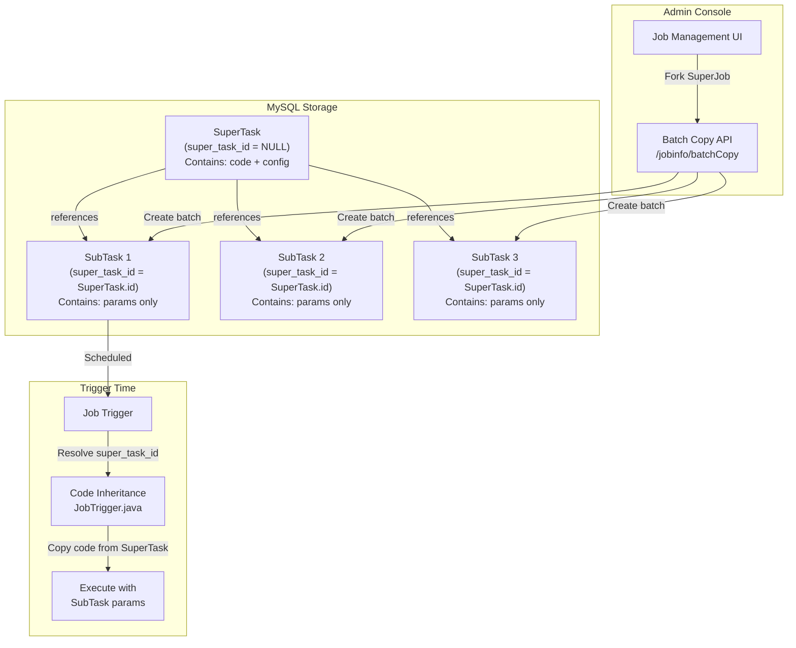
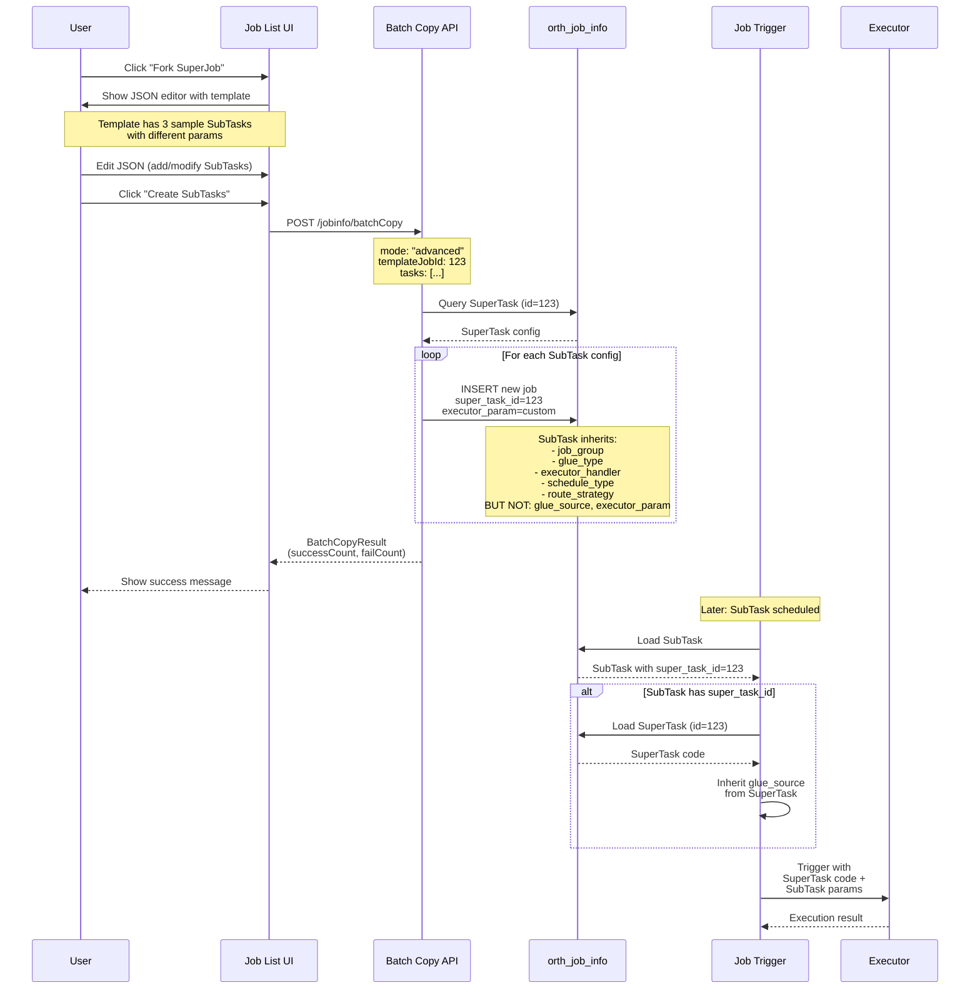

# SuperTask Template-Instance Pattern

## Core Concept

The **SuperTask pattern** implements a template-instance architecture where a parent job (SuperTask) defines executable code while child jobs (SubTasks) provide varying parameters. This enables batch creation of similar jobs that share code but differ in configuration.

**Key Principle**: Code inheritance at trigger time — SubTasks dynamically inherit their SuperTask's code when executed, eliminating code duplication and enabling centralized updates.

## Architecture Overview

## Database Schema

### New Column: `super_task_id`

Added to `orth_job_info`:

| Value | Meaning |
|-------|---------|
| `NULL` | Standalone job or SuperTask |
| Non-NULL | SubTask — inherits code from referenced SuperTask |

Indexed for fast lookups during trigger. Foreign key enables cascade delete protection.

## Template-Instance Workflow

## Batch Copy API

**POST** `/jobinfo/batchCopy`

| Feature | Simple Mode | Advanced Mode |
|---------|-------------|---------------|
| **Input** | Array of strings (params) | Array of SubTaskConfig objects |
| **Name Generation** | Template-based `{origin}-{index}` | Explicit per SubTask |
| **Customization** | `executor_param` only | Full per-SubTask config (desc, schedule, params) |
| **Use Case** | Quick parameterized duplication | Complex batch with different schedules |

Returns `BatchCopyResult` with `successCount`, `failCount`, and `createdJobIds`.

## Code Inheritance Mechanism

At trigger time, `JobTrigger.java:trigger()` resolves the SuperTask chain:

1. Load SubTask from `orth_job_info`
2. If `super_task_id` is set, load the referenced SuperTask
3. Copy `glue_source` and `glue_updatetime` from SuperTask into the SubTask's in-memory object
4. Trigger with inherited code + SubTask-specific params

**Inherited from SuperTask**: `glue_source`, `glue_updatetime`

**Kept from SubTask**: `executor_param`, `job_desc`, `schedule_conf`, `alarm_email`

## Frontend Integration

### Job List UI

| Component | Location | Description |
|-----------|----------|-------------|
| Fork SuperJob button | `job.list.ftl` toolbar | Opens JSON editor with template for batch SubTask creation |
| SuperTask dropdown | Add/Update modals | Select parent SuperTask from same executor group (AJAX-loaded) |
| Edit SuperTask Code link | Update modal | Opens GLUE IDE for the SuperTask in a new tab |
| SuperTask column | Job list table | Badge display — blue for SubTasks (shows parent name), gray for standalone |
| SuperTask search filter | Search row | Searches both job name and SuperTask name via SQL JOIN |

### API Endpoints

| Method | Path | Description |
|--------|------|-------------|
| POST | `/jobinfo/batchCopy` | Create SubTasks from SuperTask template |
| GET | `/jobinfo/getSuperTaskList` | List potential SuperTasks in a job group |

### SuperTask Tag Display

The job list uses a LEFT JOIN (`JobInfoMapper.xml:pageList`) to resolve `super_task_name` from the parent. A transient `superTaskName` field on `JobInfo` carries this to the UI.

| Badge Color | Meaning | Tooltip |
|-------------|---------|---------|
| Blue (`label-primary`) | SubTask | "SubTask of: [SuperTask Name]" |
| Gray (`label-default`) | Standalone | "Standalone Job" |

## Cascade Delete Protection

SuperTasks with active SubTasks cannot be deleted. `JobServiceImpl.java:delete()` checks `countSubTasks(id)` before proceeding. Users must delete all SubTasks first.

A database-level foreign key constraint provides additional safety.

## Use Cases

- **Multi-Region Data Collection**: 1 SuperTask with scraping logic, N SubTasks with `region=XX` params. Update code once, all regions use it.
- **Batch Report Generation**: 1 report template SuperTask, 100 SubTasks with `department_id=X` and different email recipients.
- **A/B Testing**: 1 algorithm SuperTask, SubTasks with `variant=A/B/control` params.

## Performance Considerations

| Operation | Cost | Notes |
|-----------|------|-------|
| SuperTask lookup at trigger | ~1-2ms | Indexed PK query, cacheable |
| Batch creation (100 SubTasks) | ~500ms | Sequential INSERTs; could optimize with JDBC batch (~50ms) |

## Critical Analysis

### Strengths

1. **Code Reusability**: Single source of truth for shared logic
2. **Maintenance Efficiency**: Update once, affects all SubTasks
3. **Parameterization**: Easy to create variations with different configs
4. **Scalability**: Supports thousands of SubTasks per SuperTask
5. **Flexibility**: SubTasks can override schedule, email, description

### Weaknesses

1. **Runtime Dependency**: SubTask execution depends on SuperTask existence
2. **Code Versioning**: No built-in version control for code changes
3. **Testing Complexity**: SuperTask changes affect all SubTasks simultaneously
4. **Query Overhead**: Additional database query per SubTask trigger

### Risks and Mitigations

| Risk | Mitigation |
|------|------------|
| Breaking changes propagate to all SubTasks | Add `super_task_version` column for version pinning |
| Accidental SuperTask deletion orphans SubTasks | Cascade delete protection (service + DB FK) |
| Large `glue_source` duplicated in memory | Application-layer caching (Redis or MyBatis L2) |

### Future Enhancements

- **SuperTask versioning**: SubTasks lock to a specific code version
- **Dry-run mode**: Simulate batch copy without creating jobs (`?dryRun=true`)
- **Cascading config updates**: Propagate SuperTask field changes to SubTasks
