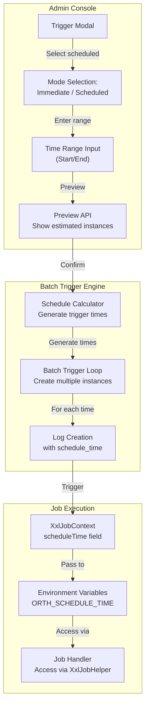
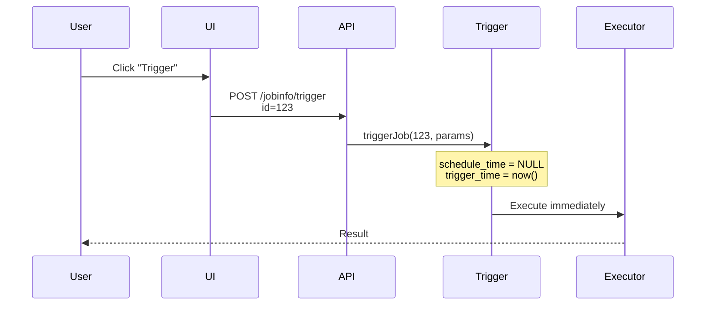
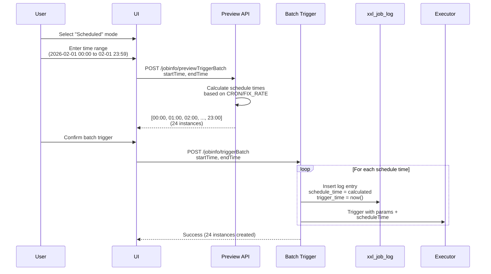

# Batch Trigger with Logical Schedule Time

## Core Concept

The **batch trigger** feature enables manual triggering of multiple job instances within a specified time range, each with a **logical schedule time**. This is essential for backfilling missed executions, testing scheduled jobs, and reprocessing historical data.

**Key Distinction**:
- **Trigger Time** = Actual execution time (when job runs)
- **Schedule Time** = Logical scheduled time (when job was supposed to run)

This separation allows jobs to know their intended execution context, critical for time-sensitive data processing tasks in the Abyss project.

## Architecture Overview



## Trigger Mode Comparison

### Immediate Trigger (Existing)



**Use Case**: Ad-hoc manual execution, testing

### Scheduled Trigger (New)



**Use Case**: Backfilling, historical reprocessing, testing time-dependent logic

## Database Schema

### New Column: `schedule_time`

```sql
ALTER TABLE xxl_job_log
ADD COLUMN schedule_time DATETIME DEFAULT NULL COMMENT 'Logical scheduled time (NULL for immediate triggers)';
```

**Field Semantics**:
- `trigger_time` - When the job was actually triggered (always set)
- `schedule_time` - When the job was logically scheduled to run (NULL for manual immediate triggers)

**Example Values**:

| Trigger Type | trigger_time | schedule_time | Interpretation |
|-------------|--------------|---------------|----------------|
| Immediate | 2026-02-10 15:30:00 | NULL | Manual trigger right now |
| Scheduled | 2026-02-10 15:30:00 | 2026-02-01 00:00:00 | Backfill for Feb 1 midnight |
| Normal CRON | 2026-02-10 02:00:00 | 2026-02-10 02:00:00 | Automatic scheduled trigger |

## Schedule Time Calculation

### CRON Jobs

**Algorithm**: Parse CRON expression and generate all matching times in range

```java
public List<Date> calculateScheduleTimes(String cronExpression, Date startTime, Date endTime) {
    List<Date> times = new ArrayList<>();
    CronExpression cron = new CronExpression(cronExpression);

    Date current = startTime;
    while (current.before(endTime)) {
        Date next = cron.getNextValidTimeAfter(current);
        if (next == null || next.after(endTime)) {
            break;
        }
        times.add(next);
        current = next;

        if (times.size() >= 100) {
            break; // Safety cap
        }
    }

    return times;
}
```

**Example**:
- CRON: `0 0 * * * ?` (every hour)
- Range: 2026-02-01 00:00 to 2026-02-01 23:59
- Result: 24 instances (00:00, 01:00, ..., 23:00)

### FIX_RATE Jobs

**Algorithm**: Add interval repeatedly from start time

```java
public List<Date> calculateScheduleTimes(int intervalSeconds, Date startTime, Date endTime) {
    List<Date> times = new ArrayList<>();

    Date current = startTime;
    while (current.before(endTime)) {
        times.add(current);
        current = new Date(current.getTime() + intervalSeconds * 1000L);

        if (times.size() >= 100) {
            break; // Safety cap
        }
    }

    return times;
}
```

**Example**:
- Interval: 3600 seconds (1 hour)
- Range: 2026-02-01 00:00 to 2026-02-01 05:00
- Result: 6 instances (00:00, 01:00, 02:00, 03:00, 04:00, 05:00)

### FIX_DELAY Jobs

**Special Case**: Only one instance at start time

```java
public List<Date> calculateScheduleTimes(Date startTime, Date endTime) {
    // FIX_DELAY jobs don't have a predictable schedule
    // Only trigger once at the specified start time
    return Collections.singletonList(startTime);
}
```

**Rationale**: FIX_DELAY depends on previous execution completion time, making batch prediction impossible.

### NONE (Manual-only) Jobs

**Validation**: Reject batch trigger for NONE schedule type

```java
if (scheduleType == ScheduleTypeEnum.NONE) {
    return Response.ofFail("Batch trigger not supported for NONE schedule type");
}
```

**Rationale**: Manual-only jobs have no inherent schedule to calculate.

## Preview API

### Endpoint

**POST** `/jobinfo/previewTriggerBatch`

**Request**:
```json
{
  "id": 123,
  "startTime": "2026-02-01 00:00:00",
  "endTime": "2026-02-01 23:59:59"
}
```

**Response**:
```json
{
  "code": 200,
  "data": [
    "2026-02-01 00:00:00",
    "2026-02-01 01:00:00",
    "2026-02-01 02:00:00",
    ...
    "2026-02-01 23:00:00"
  ]
}
```

### Frontend Integration

**JavaScript Handler**:

```javascript
$("#jobTriggerModal").on('change', 'input[name="startTime"], input[name="endTime"]', function() {
    var jobId = $("#jobTriggerModal .form input[name='id']").val();
    var startTime = $("#jobTriggerModal .form input[name='startTime']").val();
    var endTime = $("#jobTriggerModal .form input[name='endTime']").val();

    // Debounced API call (500ms)
    $.ajax({
        type: 'POST',
        url: base_url + "/jobinfo/previewTriggerBatch",
        data: { "id": jobId, "startTime": startTime, "endTime": endTime },
        success: function(data) {
            var count = data.data.length;
            $("#instanceCountHint").text('Will create ' + count + ' instances');
            $("#instanceCountHintGroup").show();
        }
    });
});
```

**UI Features**:
- Real-time instance count preview
- Warning when count >= 100 (safety cap)
- "Show Details" link to expand full schedule time list
- Debounced to prevent excessive API calls

## Context Propagation

### XxlJobContext Extension

**Location**: `XxlJobContext.java`

```java
public class XxlJobContext {
    private Date scheduleTime; // NEW: Logical schedule time
    private Date triggerTime;  // EXISTING: Actual trigger time

    public Date getScheduleTime() {
        return scheduleTime;
    }

    public void setScheduleTime(Date scheduleTime) {
        this.scheduleTime = scheduleTime;
    }
}
```

### XxlJobHelper API

**Location**: `XxlJobHelper.java`

```java
public class XxlJobHelper {
    /**
     * Get the logical scheduled time for this job execution.
     *
     * Returns NULL for immediate manual triggers.
     * Returns the calculated schedule time for batch triggers.
     *
     * Use case: Backfilling historical data where the job needs to know
     * which time period to process.
     */
    public static Date getScheduleTime() {
        XxlJobContext context = getXxlJobContext();
        return context != null ? context.getScheduleTime() : null;
    }
}
```

### Environment Variables (Script Jobs)

**Location**: `ScriptJobHandler.java`

```java
// Prepare environment variables for script execution
Map<String, String> env = new HashMap<>();
env.put("ORTH_JOB_ID", String.valueOf(jobId));
env.put("ORTH_JOB_PARAM", executorParams);
env.put("ORTH_LOG_ID", String.valueOf(logId));

// NEW: Schedule time
if (scheduleTime != null) {
    env.put("ORTH_SCHEDULE_TIME",
            new SimpleDateFormat("yyyy-MM-dd HH:mm:ss").format(scheduleTime));
}

// Trigger time (actual execution time)
env.put("ORTH_TRIGGER_TIME",
        new SimpleDateFormat("yyyy-MM-dd HH:mm:ss").format(triggerTime));
```

**Environment Variable Reference**:

| Variable | Type | Description |
|----------|------|-------------|
| `ORTH_JOB_ID` | int | Job ID from xxl_job_info |
| `ORTH_JOB_PARAM` | string | Executor parameters |
| `ORTH_LOG_ID` | long | Log entry ID |
| `ORTH_SCHEDULE_TIME` | datetime | Logical schedule time (NULL for immediate) |
| `ORTH_TRIGGER_TIME` | datetime | Actual trigger time |
| `ORTH_SHARD_INDEX` | int | Shard index (for broadcast jobs) |
| `ORTH_SHARD_TOTAL` | int | Total shard count |

### Python Script Example

```python
#!/usr/bin/env python3
import os
from datetime import datetime

# Access schedule time
schedule_time_str = os.environ.get('ORTH_SCHEDULE_TIME')
trigger_time_str = os.environ.get('ORTH_TRIGGER_TIME')

if schedule_time_str:
    schedule_time = datetime.strptime(schedule_time_str, '%Y-%m-%d %H:%M:%S')
    print(f"Processing data for logical time: {schedule_time}")

    # Use schedule_time to query historical data
    query = f"SELECT * FROM metrics WHERE timestamp >= '{schedule_time}' AND timestamp < '{schedule_time + timedelta(hours=1)}'"
else:
    print("Immediate trigger - processing current data")
    query = "SELECT * FROM metrics WHERE timestamp >= NOW() - INTERVAL 1 HOUR"

# Execute query...
```

## Safety Mechanisms

### 1. Instance Count Cap

**Limit**: Maximum 100 instances per batch trigger

```java
if (scheduleTimes.size() >= 100) {
    return Response.ofFail("Batch trigger would create " + scheduleTimes.size() +
                           " instances (max 100). Please reduce time range.");
}
```

**Rationale**: Prevent accidental resource exhaustion from overly broad time ranges

### 2. Time Range Validation

```java
if (startTime.after(endTime)) {
    return Response.ofFail("Start time must be before end time");
}

long rangeSeconds = (endTime.getTime() - startTime.getTime()) / 1000;
if (rangeSeconds > 86400 * 7) { // 7 days
    return Response.ofFail("Time range too large (max 7 days)");
}
```

### 3. Schedule Type Validation

```java
if (scheduleType == ScheduleTypeEnum.NONE) {
    return Response.ofFail("Batch trigger not supported for NONE schedule type");
}
```

### 4. Permission Check

```java
if (!JobGroupPermissionUtil.hasPermission(loginInfo, jobInfo.getJobGroup())) {
    return Response.ofFail("Permission denied for job group");
}
```

## Use Cases

### 1. Backfilling Missing Data

**Scenario**: System was down on 2026-02-01, need to reprocess all hourly jobs for that day.

**Steps**:
1. Select the hourly data collection job
2. Click "Trigger" → Select "Scheduled" mode
3. Enter range: 2026-02-01 00:00 to 2026-02-01 23:59
4. Preview shows 24 instances
5. Confirm → All 24 instances triggered with appropriate schedule_time
6. Job handler uses `XxlJobHelper.getScheduleTime()` to know which hour to process

### 2. Testing Time-Dependent Logic

**Scenario**: Monthly report job needs testing with different months.

**Steps**:
1. Select monthly report job (CRON: `0 0 1 * * ?`)
2. Trigger with range: 2025-01-01 to 2025-12-31
3. Preview shows 12 instances (first day of each month)
4. Confirm → Test report generation for all 12 months
5. Verify report content matches expected month from schedule_time

### 3. Parallel Historical Reprocessing

**Scenario**: Need to reprocess last 30 days of data, one day per job instance.

**Steps**:
1. Create a FIX_RATE job with 86400-second interval (1 day)
2. Trigger with range: 30 days ago to today
3. Preview shows 30 instances
4. Confirm → All 30 instances run in parallel (executor pool permitting)
5. Each instance processes its assigned day based on schedule_time

## Performance Considerations

### Trigger Latency

**Sequential Triggering**:
- Current: Loop triggers one-by-one
- Latency: ~10ms per trigger
- 100 instances: ~1 second total

**Potential Optimization** (Future):
```java
// Batch insert log entries
List<XxlJobLog> logs = scheduleTimes.stream()
    .map(time -> createLogEntry(jobId, time))
    .collect(Collectors.toList());

xxlJobLogMapper.batchInsert(logs);

// Trigger in parallel
ExecutorService executor = Executors.newFixedThreadPool(10);
logs.forEach(log -> executor.submit(() -> triggerJob(log)));
```

### Database Impact

**Log Table Growth**:
- 100 instances = 100 new rows in xxl_job_log
- Negligible for modern databases
- Consider log cleanup policies for high-volume use

### Executor Load

**Concurrent Execution**:
- All batch instances trigger simultaneously
- Limited by executor thread pool (200 fast + 100 slow)
- May queue if pool saturated

**Mitigation**: Add optional staggered triggering mode
```java
// Trigger with 1-second delay between instances
for (Date scheduleTime : scheduleTimes) {
    triggerJob(jobId, scheduleTime);
    Thread.sleep(1000);
}
```

## Environment Variable Migration

### Renamed Variables (XXL_JOB → ORTH)

| Old Name | New Name | Reason |
|----------|----------|--------|
| `XXL_JOB_*` | `ORTH_*` | Rebranding for Orth fork |
| Generic | Specific | Clarify project identity |

**Migration Path**:
- Both prefixes supported during transition
- Deprecation warning for XXL_JOB_*
- Full removal in v4.0

### Script Compatibility

**Update Required** for scripts using old variables:

```bash
# Old (deprecated)
echo "Job ID: $XXL_JOB_ID"
echo "Param: $XXL_JOB_PARAM"

# New (recommended)
echo "Job ID: $ORTH_JOB_ID"
echo "Param: $ORTH_JOB_PARAM"
echo "Schedule Time: $ORTH_SCHEDULE_TIME"
echo "Trigger Time: $ORTH_TRIGGER_TIME"
```

## Internationalization

### New i18n Keys

**English** (`message_en.properties`):
```properties
jobinfo_trigger_mode_immediate=Immediate Trigger
jobinfo_trigger_mode_scheduled=Scheduled Trigger
jobinfo_trigger_start_time=Start Time
jobinfo_trigger_end_time=End Time
jobinfo_trigger_instance_count=Will create {0} job instances
jobinfo_trigger_max_instances_warning=Maximum {0} instances allowed
```

**Chinese Simplified** (`message_zh_CN.properties`):
```properties
jobinfo_trigger_mode_immediate=立即触发
jobinfo_trigger_mode_scheduled=定时触发
jobinfo_trigger_start_time=开始时间
jobinfo_trigger_end_time=结束时间
jobinfo_trigger_instance_count=将创建 {0} 个任务实例
jobinfo_trigger_max_instances_warning=最多允许 {0} 个实例
```

## API Summary

### Endpoints

| Method | Path | Description |
|--------|------|-------------|
| POST | `/jobinfo/trigger` | Immediate trigger (existing) |
| POST | `/jobinfo/triggerBatch` | Batch trigger with schedule times (new) |
| POST | `/jobinfo/previewTriggerBatch` | Preview schedule times (new) |

### Request/Response Examples

**Preview Request**:
```bash
curl -X POST http://localhost:8080/xxl-job-admin/jobinfo/previewTriggerBatch \
  -H "Content-Type: application/x-www-form-urlencoded" \
  -d "id=123&startTime=2026-02-01 00:00:00&endTime=2026-02-01 23:59:59"
```

**Preview Response**:
```json
{
  "code": 200,
  "data": [
    "2026-02-01 00:00:00",
    "2026-02-01 01:00:00",
    "2026-02-01 02:00:00"
  ]
}
```

**Batch Trigger Request**:
```bash
curl -X POST http://localhost:8080/xxl-job-admin/jobinfo/triggerBatch \
  -H "Content-Type: application/x-www-form-urlencoded" \
  -d "id=123&startTime=2026-02-01 00:00:00&endTime=2026-02-01 23:59:59&executorParam=region=A"
```

**Batch Trigger Response**:
```json
{
  "code": 200,
  "msg": "Batch trigger successful: 24 instances created"
}
```

## Critical Analysis

### Strengths

1. **Historical Processing**: Enable backfilling without manual timestamp passing
2. **Time Awareness**: Jobs know their logical context (schedule_time vs trigger_time)
3. **Preview Safety**: Users can verify instance count before triggering
4. **Flexible Range**: Support CRON, FIX_RATE, FIX_DELAY schedule types
5. **Environment Variables**: Script jobs access schedule_time without code changes

### Weaknesses

1. **Sequential Triggering**: 100 instances take ~1 second to trigger
2. **Memory Overhead**: Storing 100 schedule times in memory
3. **No Progress Tracking**: Can't monitor batch trigger progress
4. **Fixed Cap**: 100-instance limit may be insufficient for some use cases

### Risks

1. **Executor Overload**: 100 simultaneous triggers may saturate thread pool
2. **Database Contention**: Rapid log insertion may cause lock contention
3. **Time Zone Confusion**: UI time input assumes server timezone
4. **Accidental Mass Trigger**: User error could trigger thousands of jobs

### Mitigation Strategies

1. **Staggered Triggering**: Add optional delay between instances
2. **Progress API**: Return batch_id for tracking via separate endpoint
3. **Timezone Selector**: Add timezone picker to UI
4. **Confirmation Dialog**: Show instance count and estimated load impact

## Future Enhancements

### 1. Asynchronous Batch Triggering

```java
@Async
public CompletableFuture<BatchTriggerResult> triggerBatchAsync(
    int jobId, Date startTime, Date endTime) {

    List<Date> scheduleTimes = calculateScheduleTimes(jobId, startTime, endTime);
    List<Long> logIds = new ArrayList<>();

    for (Date scheduleTime : scheduleTimes) {
        long logId = triggerJob(jobId, scheduleTime);
        logIds.add(logId);
    }

    return CompletableFuture.completedFuture(
        new BatchTriggerResult(logIds.size(), logIds)
    );
}
```

### 2. Batch Progress Tracking

```java
@RequestMapping("/batchTriggerProgress")
public Response<BatchProgress> getBatchProgress(@RequestParam String batchId) {
    // Return: total, completed, running, failed
}
```

### 3. Custom Schedule Time Overrides

Allow manual specification of schedule times for edge cases:

```json
{
  "jobId": 123,
  "scheduleTimes": [
    "2026-02-01 00:00:00",
    "2026-02-01 06:30:15",  // Custom non-aligned time
    "2026-02-01 12:45:30"
  ]
}
```

### 4. Conditional Batch Triggering

Skip instances that already have successful logs:

```java
if (hasSuccessfulLog(jobId, scheduleTime)) {
    log.info("Skipping duplicate: " + scheduleTime);
    continue;
}
```

## Integration with Abyss Project

### Data Collection Pipeline

The batch trigger feature directly supports Abyss project requirements:

1. **High-Performance Batch Collection**:
   - Backfill missing collection periods
   - Reprocess data with updated logic
   - Test collection across multiple time periods

2. **Low-Latency Streaming**:
   - Replay historical stream data
   - Validate stream processing logic
   - Generate training data for ML models

3. **Enhanced Coordination**:
   - Manager triggers batch collection for workers
   - Each worker knows its assigned time period
   - Parallel processing of historical ranges

## Conclusion

The batch trigger with logical schedule time feature provides essential capabilities for historical data processing and backfilling in the Orth scheduler. By separating trigger time from schedule time, jobs gain context awareness critical for time-sensitive data operations in the Abyss project.

**Recommended For**:
- Data backfilling after system downtime
- Historical reprocessing with updated logic
- Testing time-dependent job behavior
- Parallel processing of time-series data

**Not Recommended For**:
- Real-time immediate execution (use immediate trigger)
- Jobs that don't care about logical time
- Very large time ranges (>100 instances)
