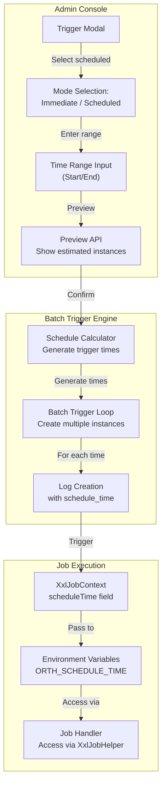
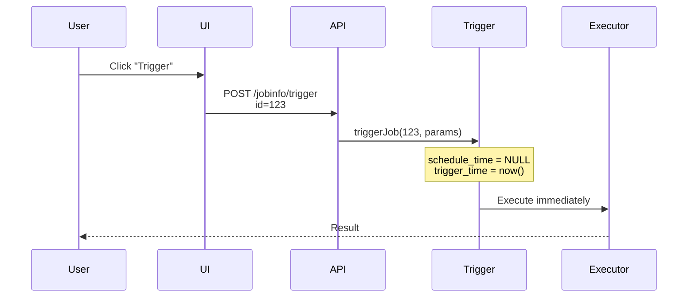
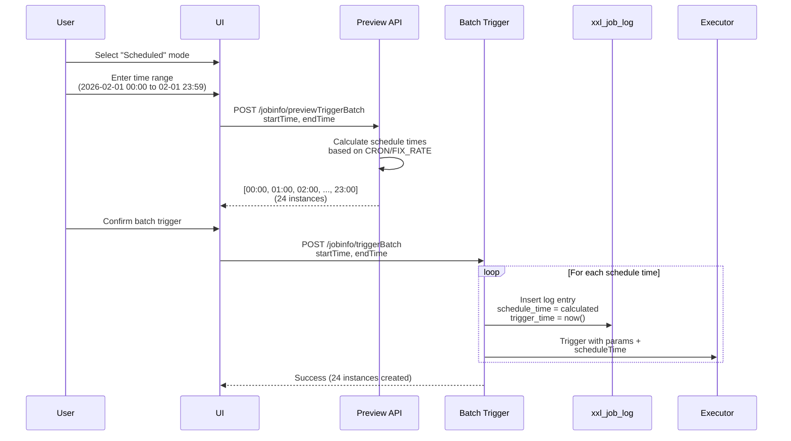

# Batch Trigger with Logical Schedule Time

## Core Concept

The **batch trigger** feature enables manual triggering of multiple job instances within a specified time range, each with a **logical schedule time**. This is essential for backfilling missed executions, testing scheduled jobs, and reprocessing historical data.

**Key Distinction**:
- **Trigger Time** = Actual execution time (when job runs)
- **Schedule Time** = Logical scheduled time (when job was supposed to run)

This separation allows jobs to know their intended execution context, critical for time-sensitive data processing.

## Architecture Overview

## Trigger Mode Comparison

### Immediate Trigger (Existing)

### Scheduled Trigger (New)

## Database Schema

### New Column: `schedule_time`

Added to `xxl_job_log`:

| Trigger Type | trigger_time | schedule_time | Interpretation |
|-------------|--------------|---------------|----------------|
| Immediate | 2026-02-10 15:30:00 | NULL | Manual trigger right now |
| Scheduled | 2026-02-10 15:30:00 | 2026-02-01 00:00:00 | Backfill for Feb 1 midnight |
| Normal CRON | 2026-02-10 02:00:00 | 2026-02-10 02:00:00 | Automatic scheduled trigger |

## Schedule Time Calculation

The engine generates schedule times from a time range based on the job's schedule type:

| Schedule Type | Algorithm | Example |
|--------------|-----------|---------|
| CRON | Parse expression, enumerate matching times in range | `0 0 * * * ?` over 24h → 24 instances |
| FIX_RATE | Add interval repeatedly from start time | 3600s interval over 6h → 6 instances |
| FIX_DELAY | Single instance at start time only | Unpredictable schedule (depends on prior completion) |
| NONE | Rejected — batch trigger not supported | Manual-only jobs have no schedule to calculate |

**Safety cap**: Maximum 100 instances per batch trigger. See `JobInfoController.java`.

## API Summary

| Method | Path | Description |
|--------|------|-------------|
| POST | `/jobinfo/trigger` | Immediate trigger (existing) |
| POST | `/jobinfo/triggerBatch` | Batch trigger with schedule times |
| POST | `/jobinfo/previewTriggerBatch` | Preview calculated schedule times |

The preview endpoint returns a list of calculated schedule times for the given range, enabling the UI to show instance count before confirmation.

## Context Propagation

Schedule time flows from admin to executor through the full stack:

| Layer | Mechanism | Access |
|-------|-----------|--------|
| Admin trigger | Set on `XxlJobLog.scheduleTime` | — |
| RPC call | Passed as `TriggerParam.scheduleTime` | — |
| Java handlers | `XxlJobContext.scheduleTime` field | `XxlJobHelper.getScheduleTime()` |
| Script handlers | Environment variable | `$ORTH_SCHEDULE_TIME` |

### Environment Variables (Script Jobs)

Set by `ScriptJobHandler.java` before script execution:

| Variable | Type | Description |
|----------|------|-------------|
| `ORTH_JOB_ID` | int | Job ID from xxl_job_info |
| `ORTH_JOB_PARAM` | string | Executor parameters |
| `ORTH_LOG_ID` | long | Log entry ID |
| `ORTH_SCHEDULE_TIME` | datetime | Logical schedule time (NULL for immediate) |
| `ORTH_TRIGGER_TIME` | datetime | Actual trigger time |
| `ORTH_SHARD_INDEX` | int | Shard index (for broadcast jobs) |
| `ORTH_SHARD_TOTAL` | int | Total shard count |

## Safety Mechanisms

| Mechanism | Rule | Rationale |
|-----------|------|-----------|
| Instance count cap | Max 100 per batch | Prevent resource exhaustion |
| Time range validation | `startTime < endTime`, max 7 days | Prevent overly broad ranges |
| Schedule type check | Reject NONE type | No schedule to calculate |
| Permission check | `JobGroupPermissionUtil` | Standard access control |

## Use Cases

- **Backfilling**: System was down on Feb 1 — batch trigger the hourly job for that day (24 instances), each knowing its logical hour via `getScheduleTime()`.
- **Testing time-dependent logic**: Trigger a monthly report job across Jan-Dec to verify each month's output.
- **Parallel historical reprocessing**: Create 30 instances (1 per day) for last month, each processing its assigned day.

## Performance Considerations

| Aspect | Current | Notes |
|--------|---------|-------|
| Trigger latency | ~10ms/instance (sequential) | 100 instances ≈ 1 second |
| Log table impact | 100 rows per batch | Negligible; consider cleanup policies |
| Executor load | All instances trigger simultaneously | Limited by thread pool (200 fast + 100 slow) |

## Critical Analysis

### Strengths

1. **Historical Processing**: Enables backfilling without manual timestamp passing
2. **Time Awareness**: Jobs know their logical context (`schedule_time` vs `trigger_time`)
3. **Preview Safety**: Users verify instance count before triggering
4. **Flexible Range**: Supports CRON, FIX_RATE, FIX_DELAY schedule types
5. **Environment Variables**: Script jobs access schedule_time without code changes

### Weaknesses

1. **Sequential Triggering**: 100 instances take ~1 second to trigger
2. **No Progress Tracking**: Cannot monitor batch trigger progress
3. **Fixed Cap**: 100-instance limit may be insufficient for some use cases

### Risks and Mitigations

| Risk | Mitigation |
|------|------------|
| Executor overload from simultaneous triggers | Add optional staggered triggering with delay |
| Time zone confusion in UI | Add timezone selector to trigger modal |
| Accidental mass trigger | Preview + confirmation dialog with instance count |

### Future Enhancements

- **Asynchronous batch triggering**: Return immediately with a `batchId`, poll for progress
- **Progress tracking**: `GET /batchTriggerProgress?batchId=X` returning total/completed/failed
- **Custom schedule times**: Allow manual specification of arbitrary times instead of calculated range
- **Conditional triggering**: Skip instances that already have successful logs
